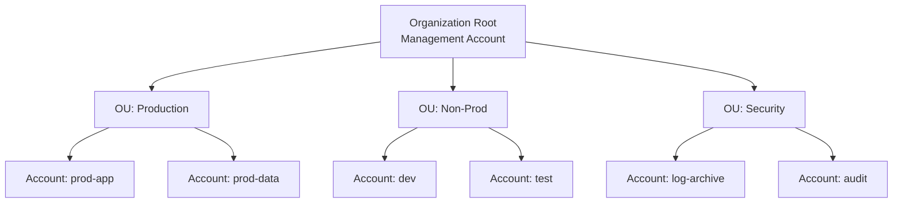
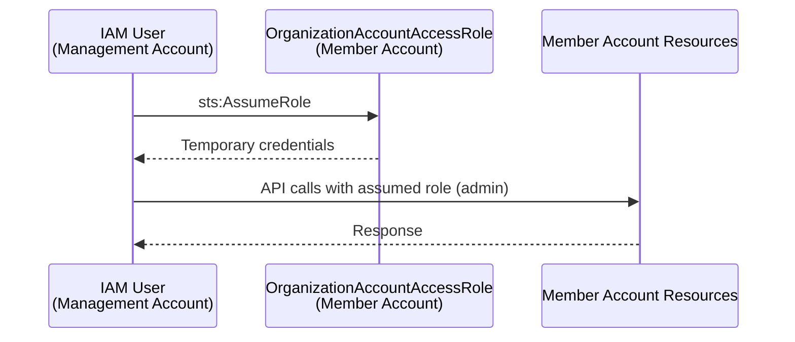
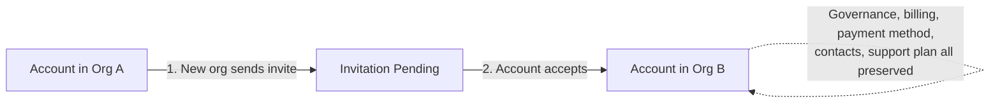
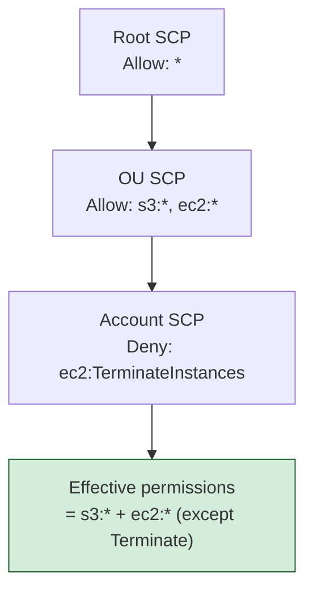
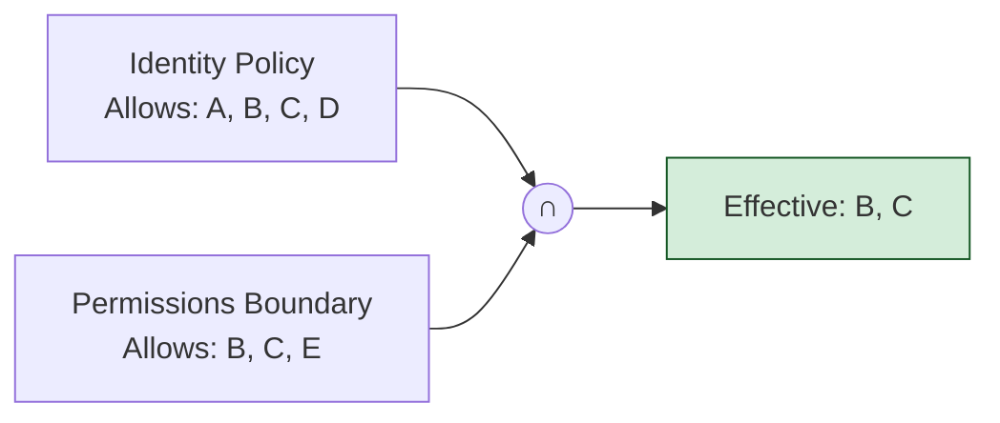

# AWS Organizations

> **Policy-based management for multiple AWS accounts.**

Maps to: **Domain 1.4 — Design a multi-account AWS environment**

---

## General

**AWS Organization** is an account management service that consolidates multiple AWS accounts into an **Organization** for centralized management:

- Consolidated billing
- Organize accounts into groups / **OUs** for access control
- Attach policy-based controls — **Service Control Policies (SCPs)**
- Split accounts by:
  - environment
  - project
  - business unit
- Organizations allows you to:
  - **Programmatically** create new accounts
  - Create and maintain groups of accounts
  - Set policies on those groups

**Organization hierarchy:**



> **OU** = Organizational Unit

---

## OrganizationAccountAccessRole

- IAM role that grants **full administrator permissions in the Member account to the Management account**
- Used to perform admin tasks in Member accounts (e.g., creating IAM users)
- Can be assumed by IAM users in the Management account
- **Automatically added** to all new Member accounts created with AWS Organizations
- ⚠️ **Must be created manually if you invite an existing Member account**

**Trust flow:**



---

## Organizations Features

### Consolidated Billing features

- Consolidated billing across all accounts — single payment method
- Pricing benefits from aggregated usage (volume discounts for EC2, S3)

### All Features (default mode)

- Includes consolidated billing features **+ SCPs**
- Invited accounts must approve enabling all features
- Ability to apply an SCP to _prevent member accounts from leaving the org_
- ❗ **Cannot switch back to Consolidated Billing Features only**

---

## Reserved Instances in Organizations

- Consolidated billing treats all accounts as one for billing purposes
- **All accounts** in the organization can receive the hourly cost benefit of RIs purchased by any other account
- The **payer (Management) account** can **turn off** Reserved Instance (RI) and Savings Plans (SP) discount sharing for any account, including the payer
- For sharing to apply, **both** the purchasing account and the benefiting account must have sharing **turned on**

---

## Multi-Account Strategies

Reasons to use multi-account:

- Per department, per cost center, per dev/test/prod
- Regulatory restrictions (enforced via SCP)
- Better resource isolation (e.g., VPC boundaries)
- Separate per-account service limits
- Isolated account for **logging**
- Dedicated account for **security**

Best practices:

- Use **tagging standards** for billing
- Enable **CloudTrail** on all accounts → send logs to a **central S3 account**
- Send **CloudWatch Logs** to a central logging account

---

## Moving Accounts Between Organizations

- You can now **directly transfer** an account to a different organization **without removing it first**
- The account maintains governance and consolidated billing throughout the transfer
- No need to manually configure payment method, contacts, or support plan during transfer
- Same console/API flow: new org sends invite → account accepts
- Available in all commercial and GovCloud regions

**Direct transfer flow:**



---

## Service Control Policies (SCP)

**SCP** centrally controls the use of AWS services across multiple accounts:

- Define allowlist or blocklist of IAM actions
- Applied at the **OU** or **Account** level ❗
- **Does NOT apply to the management account**
- Applied to all **Users and Roles** in the account, **including Root user**
- ⚠️ **SCPs do NOT affect Service-linked roles** — they enable other AWS services to integrate with Organizations and cannot be restricted by SCP
- Can be used as a permissions boundary
- Must contain an **explicit ALLOW** (nothing is allowed by default)
- **Full IAM Policy Language Support** — SCPs support conditions in allow statements and individual resource ARNs in deny statements (e.g., "allow EC2 actions only if instances have specific tags", "deny access to a specific S3 bucket by ARN")
- **Size limit: 5,120 characters** (including whitespace)
- SCPs are evaluated at every API call — they do **NOT grant** permissions, they only **filter** what IAM policies allow
- **Inheritance**: SCPs attached to the root apply to all OUs and accounts; SCPs at OU level apply to all child accounts and OUs. Effective SCP = **intersection** of all SCPs from root down to the account

### Use Cases

- Restrict access to certain services (e.g., can't use EMR)
- Enforce PCI compliance by explicitly disabling services
- Prevent member accounts from leaving the organization
- Restrict regions where workloads can run (using `aws:RequestedRegion` condition)
- Require encryption on S3 buckets or EBS volumes
- Prevent disabling of CloudTrail, GuardDuty, or other security services

**SCP inheritance (intersection from root → account):**



**Example SCP — deny if not in approved region:**

```json
{
  "Version": "2012-10-17",
  "Statement": [
    {
      "Effect": "Deny",
      "Action": "*",
      "Resource": "*",
      "Condition": {
        "StringNotEquals": {
          "aws:RequestedRegion": ["eu-west-1", "eu-central-1"]
        }
      }
    }
  ]
}
```

> 💡 **Logs and SCPs**: For scenarios about centralized, tamper-proof logs, combine centralized logging with SCPs that prevent edits/deletes.

---

## Restricting Tags with IAM Policies

- Restrict specific tags on AWS resources using the **`aws:TagKeys`** Condition Key
- Validate Tag Keys attached to a resource against Tag Keys in the IAM Policy
- Example: allow IAM users to create EBS Volumes only if they have `Env` and `CostCenter` tags
- Use:
  - **`ForAllValues`** — must have all listed keys
  - **`ForAnyValue`** — must have at least one of these keys

**Example IAM policy — require Env + CostCenter tags on EBS create:**

```json
{
  "Version": "2012-10-17",
  "Statement": [
    {
      "Effect": "Allow",
      "Action": "ec2:CreateVolume",
      "Resource": "*",
      "Condition": {
        "ForAllValues:StringEquals": {
          "aws:TagKeys": ["Env", "CostCenter"]
        }
      }
    }
  ]
}
```

### Permissions Boundary

A **permissions boundary** is an advanced managed policy that sets the **maximum permissions** an identity-based policy can grant to an IAM entity. The entity's effective permissions = identity-based policy **∩** permissions boundary.

- Restricts the actions users, groups, and roles can do — **including root!**

**Effective permissions:**



---

## Using SCP to Restrict Creating Resources Without Tags

- Prevent IAM Users/Roles in Member accounts from creating resources unless they have a specific tag
- Use **`aws:RequestTag/<TagKey>`** in the SCP condition

**Example SCP — deny EC2 launches without a `Project` tag:**

```json
{
  "Version": "2012-10-17",
  "Statement": [
    {
      "Effect": "Deny",
      "Action": "ec2:RunInstances",
      "Resource": "arn:aws:ec2:*:*:instance/*",
      "Condition": {
        "Null": {
          "aws:RequestTag/Project": "true"
        }
      }
    }
  ]
}
```

---

## Tag Policies

- Standardize tags across resources in an AWS Organization
- Ensure consistent tags, audit tagged resources, maintain proper categorization
- Define Tag Keys and their allowed values
- Helps with **AWS Cost Allocation Tags** and **Attribute-Based Access Control (ABAC)**
- Prevent non-compliant tagging operations on specified services/resources
- Generate reports listing tagged / non-compliant resources
- Use **Amazon EventBridge** to monitor non-compliant tags

**Example tag policy — enforce `CostCenter` key with allowed values:**

```json
{
  "tags": {
    "CostCenter": {
      "tag_key": { "@@assign": "CostCenter" },
      "tag_value": { "@@assign": ["1001", "1002", "1003"] },
      "enforced_for": { "@@assign": ["ec2:instance", "s3:bucket"] }
    }
  }
}
```

---

## Using SCP to Deny a Region

- Use the **`aws:RequestedRegion`** condition key in a Deny statement

---

## Multi-Account Cross-Account Access

**Role switching** = accessing one account from another using a single set of credentials. Used both within Organizations and between unconnected accounts.

1. Role in account B trusts account A
2. An identity in account A assumes the role in account B
3. Using that role, it operates inside account B

### Common cross-account access patterns (exam-tested)

- Management account → member account via **OrganizationAccountAccessRole**
- Shared services account → workload accounts via custom cross-account roles
- Security/audit account → all accounts via delegated administrator roles
- **AWS IAM Identity Center** (formerly AWS SSO) provides centralized access management across all accounts with a single login portal

---

## AI Services Opt-out Policies

- Some AWS AI services (Amazon Lex, Comprehend, Polly, etc.) may use your content to improve AI/ML services
- Opt-out policies prevent your content from being stored or used
- Enforce setting across all Member accounts and AWS Regions
- Can be attached to Organization root, specific OU, or individual member account

**Example opt-out policy — opt all services out:**

```json
{
  "services": {
    "@@operators_allowed_for_child_policies": ["@@none"],
    "default": {
      "@@operators_allowed_for_child_policies": ["@@none"],
      "opt_out_policy": {
        "@@operators_allowed_for_child_policies": ["@@none"],
        "@@assign": "optOut"
      }
    }
  }
}
```

---

## Resource Control Policies (RCPs)

- RCPs are the **resource-side** counterpart to SCPs
- While SCPs restrict what **principals** (users/roles) can do, **RCPs restrict what can be done TO resources**
- Offer central control over the **maximum available permissions for resources**
- Applied at Organization root, OU, or account level (same as SCPs)
- **Do NOT apply to the management account**
- RCPs and SCPs are **independent** — enable one, the other, or both
- When both enabled: effective permissions = **intersection** of SCPs + RCPs + identity-based policies + resource-based policies

### Key use case

Prevent resources from being accessed by principals **outside** your organization, even if the resource policy allows it.

**Example**: An RCP can deny S3 bucket access where `aws:PrincipalOrgID` does not match your org ID — blocking external access regardless of bucket policy.

> SCPs protect from the **identity side** ("our people can't do X"); RCPs protect from the **resource side** ("our resources can't be accessed by Y").

---

## Declarative Policies

- Management policy type that **declares and enforces desired configurations** for AWS services at organization scale
- Currently supports **EC2, EBS, and VPC** configurations
- Unlike SCPs (which filter API calls), declarative policies enforce configurations **directly at the service level** — non-compliant actions are prevented regardless of IAM roles or service-linked roles

### Supported service attributes

- **VPC Block Public Access** — controls whether resources in VPCs/subnets can reach the internet through IGWs
- **Instance Metadata Defaults** — enforce **IMDSv2** for all new EC2 launches
- **Allowed Images Settings** — restrict which AMIs can be used (Allowed AMIs)
- **Serial Console Access** — control EC2 serial console access
- **EBS Snapshot Block Public Access** — prevent public sharing of EBS snapshots
- **EC2 AMI Block Public Access** — prevent public sharing of AMIs

- Applied at Organization root, OU, or account level
- Configuration is **durable** — maintained even when the service adds new features or APIs
- **Account status report** — assess current compliance across accounts

---

## Delegated Administrator & Trusted Access

### Trusted Access

- Allows specified AWS services ("trusted services") to perform tasks in your organization on your behalf
- Examples: CloudTrail creating org-wide trail, AWS Config creating org-wide rules, Security Hub aggregating findings
- Enabling trusted access grants the service permissions — does **not** affect IAM user/role permissions

### Delegated Administrator

- AWS best practice: **minimize use of the management account** — use it only for tasks that require it
- Designate a **member account as delegated administrator** for specific services
- The delegated admin can perform the same management tasks for the organization that previously required the management account

### Common delegation patterns

| Account                  | Delegated for                                               |
| ------------------------ | ----------------------------------------------------------- |
| Security Tooling         | Security Hub, GuardDuty, Inspector, Macie, Firewall Manager |
| Audit / Compliance       | AWS Config, CloudTrail, Audit Manager                       |
| Networking               | RAM, VPC IPAM                                               |
| DevOps / Shared Services | Systems Manager, Service Catalog                            |

- Not all services support delegation — check service docs
- Delegated admin for one service does **NOT** give delegation for all services

---

## Root Access Management

- Centrally manage root user credentials for all **member accounts** from the management account
- **Newly created member accounts no longer have root credentials by default** — secure-by-default

### Two key capabilities

1. **Root credentials management** — remove long-term root credentials and prevent credential recovery for member accounts
2. **Root sessions** — perform privileged root actions (restoring locked S3 bucket policies, SQS queue policies) without needing root credentials

### Security benefits

- Fewer root credentials to secure with MFA
- Eliminates need to configure MFA on member account root users
- Prevents unauthorized root access to member accounts
- Use SCP to prevent member accounts from re-enabling root credentials

---

## Complete Policy Types Taxonomy

### Authorization Policies (restrict permissions)

- **Service Control Policies (SCPs)** — max permissions for IAM principals in member accounts
- **Resource Control Policies (RCPs)** — max permissions for resources in member accounts

### Management Policies (configure services)

- **Declarative Policies** — enforce desired service configurations (EC2, VPC, EBS)
- **Tag Policies** — standardize tags across the organization
- **Backup Policies** — centrally define and apply AWS Backup plans
- **AI Services Opt-out Policies** — opt out of AWS using your content for AI/ML improvement
- **Chatbot Policies** — control AWS Chatbot configurations
- **Security Hub Policies** — centrally configure Security Hub standards

All policies attach at **Organization root, OU, or account level** and follow **inheritance** down the hierarchy.

---

## Consolidated Billing & CUR Details

- **Management account** = payer account → receives one bill for all member accounts
- **Volume discounts** calculated across the entire organization (aggregated usage)
- Management account can **turn off** RI and SP discount sharing for specific accounts
- For sharing to work, **both accounts** (purchaser and beneficiary) must have sharing turned on

### Cost and Usage Report (CUR 2.0)

- Management account CUR includes data for **all member accounts**
- Member account CUR only includes data for **that** member account
- After joining an org, a member can only export data from the time they joined
- After leaving an org, member loses access to Cost Explorer data from when they were in the org (management account retains it)

### AWS Billing Conductor

Create custom billing groups to model billing scenarios (e.g., showback/chargeback to business units).

---

## Backup Policies

- **AWS Backup** enables backup plans defining how to backup AWS resources
- JSON document defining backup plans across an AWS organization
- Applied at Organization root, OU, or account level
- Enables **cross-account** and **cross-region** backup copies
- Effective backup policy is the **merge** of inherited policies (unlike SCPs which intersect)
- **Immutable** Backup Plans appear in Member accounts (view-only)

---

## Exam Tips

- **AWS Organizations is the #1 topic** on the SAP-C02 exam — foundational integration point
- **~30% of questions** involve Organizations, multi-account strategy, cross-account roles, or consolidated billing
- Know **SCP evaluation logic** cold: SCPs do NOT grant permissions; effective permissions = intersection of SCP ∩ IAM policy ∩ permissions boundary. If an SCP denies, no IAM policy can override
- **SCPs do NOT apply to the management account** — classic exam trap. If the scenario requires restricting ALL accounts including management, SCP alone isn't enough
- **SCPs do NOT affect service-linked roles** — won't block service-linked role actions
- **RCPs vs SCPs**: SCP = restrict what your people can do; RCP = restrict what can be done to your resources. "Prevent external accounts from accessing our S3 buckets" → **RCP**
- **Declarative policies** answer questions like "enforce IMDSv2 across all accounts" or "block public access to VPC/EBS snapshots/AMIs organization-wide" — they work at the service level
- **Delegated administrator** appears frequently — delegate Security Hub, GuardDuty, Config to a security account, not run from management
- **Root access management** — "secure root users across all member accounts with least operational overhead" → centralized root access management
- **OrganizationAccountAccessRole** is auto-created for accounts **created** via Organizations, but **manually created** for **invited** accounts
- **CUR nuances**: management CUR has all data, member CUR has only its own; leaving the org means losing Cost Explorer history
- **Tag policies** = tag standards; **SCPs** = service usage; **backup policies** = backup plans — know the mapping
- **Direct account transfers** — "migrate an account to a different organization with minimal disruption" → direct transfer, no standalone step needed

---

## Exam Traps

- SCPs and RCPs **do not apply to the management account** — restricting it requires IAM policies within that account. "All accounts" does not include the management account for SCP/RCP purposes
- SCPs set the **maximum permissions boundary** and do not grant anything — an SCP allowing `ec2:*` does not give EC2 access; the account still needs an IAM policy that grants it
- RCPs are **organization-wide guardrails** that restrict what resource-based policies can allow — resource-based policies are per-resource and set by the account owner. They are different
- Declarative policies configure **service behavior directly** (e.g., enforce IMDSv2) — SCPs filter IAM API calls. They solve different problems despite both being organization policies
- RI/SP discount sharing is **on by default** — management must explicitly turn it off. If account B benefits from account A's RIs, that is default behavior, not misconfiguration
- SCP inheritance uses **intersection** — if the root SCP allows `*` but the OU SCP allows only `s3:*`, the effective permission is only `s3:*`. Both levels must allow the action
- Service-linked roles **bypass SCPs** — if a service still acts despite an SCP deny, suspect a service-linked role
- The management account should have **no deployed workloads** — resources in the management account are an anti-pattern. Move them to member accounts and delegate admin
- Consolidated-billing-only mode has **no SCPs, RCPs, or policy-based controls** — governance scenarios require All Features mode. Once All Features is enabled, you cannot switch back

---

## References

- [AWS Organizations User Guide](https://docs.aws.amazon.com/organizations/latest/userguide/)
- [Resource Control Policies (RCPs)](https://docs.aws.amazon.com/organizations/latest/userguide/orgs_manage_policies_rcps.html)
- [Declarative Policies](https://docs.aws.amazon.com/organizations/latest/userguide/orgs_manage_policies_declarative.html)
- [Centralize Root Access for Member Accounts](https://docs.aws.amazon.com/IAM/latest/UserGuide/id_root-enable-root-access.html)
- [AWS Security Reference Architecture — Management Account](https://docs.aws.amazon.com/prescriptive-guidance/latest/security-reference-architecture/management-account.html)
