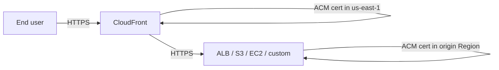

# ACM (Amazon Certificate Manager)

> **Provision, manage, deploy, and auto-renew SSL/TLS certificates for AWS-managed endpoints. Two tiers: Public certificates (free, AWS-issued, auto-renewing) and Private certificates (via AWS Private CA, paid, for internal PKI). Regional service — except CloudFront, which requires the cert in `us-east-1`. Cannot directly attach to EC2; terminate TLS at ALB / NLB / CloudFront / API Gateway.**

Maps to: **Domain 1.2 — Prescribe security controls**, **Domain 2.3 — Determine security controls for new workloads**

---

## Overview

- Provision, manage, deploy, and **auto-renew** SSL/TLS certificates
- **Two certificate types**:
  - **Public** (AWS-issued, **free**) — for internet-facing endpoints
  - **Private** (via AWS Private CA, ~$400/mo per CA + per-cert fee) — for internal PKI / mTLS
- **Regional service** — certificates exist in a specific Region (CloudFront requires `us-east-1`)
- Handles single-domain, multi-domain (SANs), and wildcard certificates (`*.example.com`)
- **Cannot export ACM-issued private keys for public certs** (security boundary); Private CA certs can be exported

---

## SSL/TLS Refresher

- SSL/TLS certificates **authenticate** the server's identity and **encrypt** the connection
- TLS is the modern successor to SSL; both terms used interchangeably
- **Asymmetric cryptography**: public key encrypts, server's private key decrypts
- Server's public key is in the certificate, **digitally signed by a trusted CA**
- After handshake, both sides use **session (symmetric) keys** for the actual data transfer
- Why certificates matter: data encryption, server authentication (anti-phishing), trust signals (padlock, HTTPS), compliance (PCI DSS, HIPAA)

---

## Where ACM Certificates Attach

| Service | Notes |
|---|---|
| **ALB / NLB** | TLS listener |
| **CloudFront** | **Cert must be in `us-east-1`** |
| **API Gateway** | REST + HTTP APIs, custom domains |
| **Elastic Beanstalk** | Through underlying ELB |
| **App Runner** | Retiring — use ECS Express Mode |
| **AppSync, Amplify, Nitro Enclaves** | Native integration |

> **NOT directly on EC2 instances** — terminate TLS at ALB / NLB / CloudFront / API Gateway. Or use Private CA / imported certs with the private key on the instance.

---

## Validation Methods

| Method | Auto-renews? | Best for |
|---|---|---|
| **DNS validation** | ✅ Yes (indefinitely while CNAME stays) | Production — recommended |
| **Email validation** | ❌ No — requires manual re-click | Quick demos / dev |

- **DNS validation**: ACM provides a CNAME; add to your DNS zone (Route 53 = one-click)
- **Email validation**: ACM emails 5 WHOIS / RFC2142 addresses

---

## Auto-Renewal

- ACM auto-renews public certs **60 days before expiry**
- Requires:
  - DNS validation CNAME still present, OR
  - Private CA still active (for private certs)
- **Imported third-party certs do NOT auto-renew** — re-import manually
- **EventBridge** emits `ACM Certificate Approaching Expiration` **45 days before expiry** → wire to Lambda / SNS for alerts

---

## Importing Third-Party Certificates

- Buy from a third-party CA, then import via Console / CLI
- Use cases:
  - Switching to AWS while preserving an existing cert
  - Organization mandates a specific CA
  - ACM not available in Region → fallback to IAM certificate store
- **No auto-renewal** — set up EventBridge expiry alerts
- Usage rights identical to ACM-issued certs (attach to ALB/NLB/CloudFront/API Gateway)

---

## AWS Private CA (formerly ACM PCA)

- Managed **private Certificate Authority** — root + subordinate CA hierarchies
- Issues X.509 certificates trusted only by your **Organization** (not the public internet)
- ~$400/mo per CA + per-certificate fee

### Use Cases

- Internal TLS / mTLS for service-to-service communication
- Code signing
- Authenticating users, computers, API endpoints, IoT devices
- Enterprise PKI build-out

### Integrations

- **ACM** — Private CA acts as a backing CA for ACM private certificates
- **Amazon EKS** — cert-manager integration for K8s workloads
- **AWS IoT Core** — device certs at scale
- **Connector for Active Directory** — issue certs for AD-joined devices
- **Connector for Kubernetes** — auto-provision certs for K8s workloads

---

## CloudFront + ACM Pattern

- **CloudFront ACM cert MUST be in `us-east-1`** regardless of origin location
- Origin-side cert can be in any Region (or use the default `*.cloudfront.net`)
- For HTTPS-to-origin (recommended): ALB needs its own ACM cert in its Region

---

## Limits & Quotas

- **2,500 ACM certificates per Region per account** (soft, raisable via Service Quotas)
- **20 SANs per certificate**
- Wildcards cover one level: `*.example.com` matches `foo.example.com` but NOT `bar.foo.example.com`
- Public certs: **RSA-2048** or **ECDSA-256/384** keys

---

## Differences From Related Services

| Service | Role |
|---|---|
| **ACM** | Issue / deploy / auto-renew TLS certs for AWS-managed endpoints |
| **AWS Private CA** | Run your own private CA hierarchy for internal PKI |
| **IAM Certificate Store** | Legacy; fallback when ACM is not available in a Region |
| **KMS** | Encryption keys for data-at-rest; ≠ certificates |
| **CloudHSM** | Customer-controlled HSM; can host CA private keys |
| **Secrets Manager** | Stores secrets (DB credentials, API keys) — not certs |

---

## Common Troubleshooting

- **Stuck "Pending Validation"** for DNS: confirm CNAME with `dig +short _<token>.example.com`; check correct zone; allow propagation time
- **Cert won't attach to CloudFront**: must be in **`us-east-1`**
- **Renewal failing**: DNS CNAME deleted, or domain CAA records block ACM's CAs (`amazon.com`, `amazontrust.com`, `awstrust.com`, `amazonaws.com`)
- **`SSL_ERROR_BAD_CERT_DOMAIN`**: cert doesn't include the requested hostname — add as SAN or use wildcard

---

## Exam Tips

- **Public ACM certs are free** on AWS-integrated services — never propose avoiding them for cost
- **DNS validation = auto-renewal forever** — always pick DNS for production
- **CloudFront ACM cert in `us-east-1`** is a critical and frequently tested fact
- **Imported third-party certs do NOT auto-renew** — set EventBridge alerts on `ACM Certificate Approaching Expiration` 45 days out
- **Private CA + ACM** is the answer for internal mTLS / service-to-service TLS without public CAs
- **EKS + cert-manager + AWS Private CA** for Kubernetes workload certificates
- **ACM is regional** — for multi-Region resilience replicate certs (or rely on CloudFront's `us-east-1` cert)
- **AWS Private CA ~$400/mo** is exam-relevant for cost questions
- **Cannot export public ACM cert private keys** — if a workload (EC2, on-prem) needs the key, use Private CA or imported certs

---

## Exam Traps

- **ACM ≠ KMS** — ACM manages TLS certs; KMS manages encryption keys for data-at-rest
- **CloudFront cert MUST be in `us-east-1`** — common distractor
- **DNS validation auto-renews; email validation does NOT** — production should always use DNS
- **Imported certs do NOT auto-renew** — must set expiry alerts via EventBridge
- **CAA DNS records can block ACM renewal** — allow `amazon.com`, `amazontrust.com`, `awstrust.com`, `amazonaws.com`
- **Cannot directly attach an ACM cert to an EC2 instance** — terminate TLS at ALB / NLB / CloudFront
- **AWS Private CA charges ~$400/mo per CA** even idle — not free like public ACM
- **Public ACM private keys cannot be exported** — for "private key on my server" use Private CA or imported certs
- **Wildcard `*.example.com` covers exactly one level** — `bar.foo.example.com` requires `*.foo.example.com` separately
- **ACM is regional** — `us-west-2` certs cannot be used by `us-east-1` resources (except CloudFront, which reads from `us-east-1` globally)
- **"ACM PCA" was renamed to "AWS Private CA"** — same service
