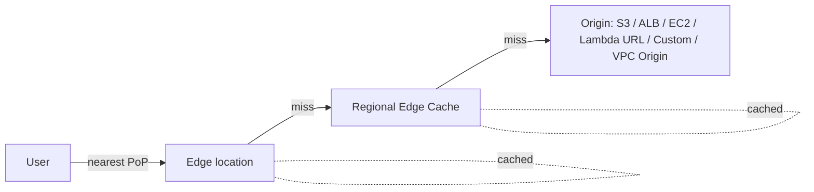

# Amazon CloudFront

> **AWS's global CDN with 600+ edge locations + 13 Regional Edge Caches. Caches HTTP/S content close to users. Origins: S3, ALB, NLB, EC2, custom HTTP, Lambda Function URLs, MediaPackage, VPC Origins, S3 static website. Edge compute via CloudFront Functions (lightweight JS at edge) + Lambda@Edge (Node/Python at REC). Modern features: KeyValueStore, Distribution Tenants, Continuous Deployment, Anycast IPs, gRPC, HTTP/3 + TLS 1.3.**

Maps to: **Domain 1.1 — Network connectivity**, **Domain 2.5 — Edge / performance**, **Domain 1.2 — Edge security (WAF / Shield)**, **Domain 2.3 — Security controls**

---

## Overview

- Global CDN — caches static + dynamic content at edges
- **600+ Points of Presence** + **13 Regional Edge Caches**
- Use cases: web / app acceleration, video streaming, software downloads, API acceleration, security perimeter
- Native integration with WAF, Shield, ACM, Route 53, Cognito, S3, Lambda@Edge

---

## Edge Architecture

- **Edge location** = first hop for viewer requests
- **Regional Edge Cache (REC)** = larger cache between edges and origin
- **REC bypassed on**: PUT / POST / DELETE, uncached query strings, Lambda@Edge origin-facing triggers
- **Origin Shield** (optional) — centralized cache tier between REC and origin; reduces origin load when many regional caches miss

---

## Origins

- **S3 bucket** (REST API + OAC)
- **S3 static website** (HTTP endpoint, no OAC)
- **ALB / NLB / EC2** (HTTP origin)
- **Custom HTTP origin** (on-prem, third-party CDN)
- **Lambda Function URLs** (sub-ms with no API Gateway)
- **MediaPackage / MediaStore** (streaming)
- **VPC Origins** — origins in **private subnets** with no public IP

### Origin Groups (multi-origin failover)

- **Primary + secondary** origin
- Failover on configurable HTTP status codes (4xx / 5xx) or connection errors
- Use case: cross-Region active-passive

---

## Origin Access Control (OAC) vs OAI (legacy)

- **OAC** (current) — secure S3 origin so ONLY CloudFront can fetch
- **OAI is legacy** — never use for new distributions
- OAC supports: SSE-KMS S3 buckets, newer AWS Regions, SigV4 signing
- Setup: create OAC in CloudFront → attach to origin → S3 bucket policy allows CloudFront service principal with `aws:SourceArn`

---

## Cache Behaviors

- **Path-based routing** — match URL paths (`/api/*` → ALB, `/static/*` → S3)
- **Order matters** — first matching path pattern wins; `*` default is always last
- Per-behavior config: methods, viewer protocol policy, cache + origin request + response headers policies, restrict viewer access, smooth streaming, compression

---

## Policy-Based Config (current best practice)

| Policy                      | Purpose                                                   |
| --------------------------- | --------------------------------------------------------- |
| **Cache Policy**            | Cache key (headers / cookies / query strings) + TTL       |
| **Origin Request Policy**   | What's forwarded to origin (separate from cache key)      |
| **Response Headers Policy** | Headers CloudFront adds/modifies (CORS, security, custom) |

- AWS-managed policies for common cases (`Managed-CachingOptimized`, `Managed-CORS-S3Origin`)
- Custom policies for fine-grained control

---

## CloudFront Functions vs Lambda@Edge

| Feature                  | **CloudFront Functions** | **Lambda@Edge**                  |
| ------------------------ | ------------------------ | -------------------------------- |
| Runtime                  | JavaScript               | Node.js, Python                  |
| Where                    | **Edge locations**       | **Regional Edge Caches**         |
| Max exec time            | **< 1 ms**               | 5 s (viewer) / 30 s (origin)     |
| Max memory               | **2 MB**                 | 128 MB (viewer) / 10 GB (origin) |
| Max package size         | 10 KB                    | 1 MB (viewer) / 50 MB (origin)   |
| Triggers                 | Viewer req/resp          | Viewer + Origin req/resp         |
| Network / FS             | No                       | Yes (origin triggers)            |
| Cost                     | ~1/6 of Lambda@Edge      | Higher                           |
| **KeyValueStore** access | Yes                      | No                               |

> CloudFront Functions + Lambda@Edge on the **same viewer event** = NOT allowed; on origin events they can combine.

---

## CloudFront KeyValueStore

- **Edge-distributed key-value store** for CloudFront Functions
- Up to **5 MB per KVS, 5 MB per item**
- Microsecond reads
- Use cases: feature flags, A/B test routing, URL rewrites with lookups, JWT verification keys

---

## Distribution Tenants

- **Multi-tenant SaaS** on a single distribution
- Per-tenant custom domain + TLS cert + behaviors
- Up to **5,000 tenants per distribution**
- Replaces "one distribution per customer" pattern

---

## Continuous Deployment

- **Staging distribution** mirrors production
- **Weighted traffic** (0–15%) or **Header-based routing** between primary + staging
- Test config changes on real traffic; **promote staging → primary** when validated
- Canary releases for CDN configuration

---

## Signed URLs / Signed Cookies

- Restrict private content access
- **Signed URLs**: one URL per file
- **Signed Cookies**: one cookie for multiple files
- **Trusted Key Groups** (IAM-managed, preferred) OR **CloudFront Key Pairs** (legacy, root account only)
- **CloudFront Signed URL ≠ S3 Pre-Signed URL**:
  - CF: account-wide signer, any origin, supports cookies
  - S3: per-user IAM creds, S3 only

---

## Field-Level Encryption

- Encrypt POST fields (credit cards, SSNs) at the edge with public-key crypto
- Decrypted at the application
- Up to **10 fields per request**, POST only
- Legacy — for new designs prefer Lambda@Edge transformation or app-layer encryption

---

## Security Layer

- **AWS WAF** — L7 protection (SQLi, XSS, rate limiting, bot control, IP allow/block)
- **Shield Standard** — always-on DDoS, free
- **Shield Advanced** — paid; 24/7 DRT support, cost protection
- **Geo-Restriction** — allow/block by country (3rd-party Geo-IP)
- **Custom error pages** — friendly messages; Error Caching Min TTL
- **Origin Custom Headers** — origin only accepts requests with a CloudFront secret header

---

## TLS / HTTPS

- **ACM cert MUST be in `us-east-1`** for CloudFront (global service reads from N. Virginia)
- **SNI by default** (HTTPS via name-based SSL); legacy dedicated IP paid + uncommon
- **HTTP/2**, **HTTP/3 (QUIC)** supported
- **TLS 1.3** for lower handshake latency
- **Min TLS version** configurable per distribution

---

## Anycast Static IPs

- Set of static anycast IPs for the distribution
- Useful for IP allowlisting on third-party firewalls / partner integrations

---

## Logging & Monitoring

- **Standard logs** — to S3 (delayed minutes); detailed per-request
- **Real-time logs** — to Kinesis Data Streams within seconds; configurable sampling + fields
- **CloudWatch metrics** — request count, error rate, bytes, cache hit rate
- **CloudFront Functions metrics** — per-function CPU + compute util
- **CloudTrail** — control-plane audit

---

## Price Classes

- **All edge locations** (default) — best perf, highest cost
- **Price Class 200** — drop India, Australia, China, S Korea
- **Price Class 100** — US, Canada, Europe, Israel only

---

## CloudFront + Cognito

- Lambda@Edge validates Cognito JWT before serving private content
- Redirect unauthenticated → Cognito Hosted UI → return with token → Lambda@Edge verifies per request

---

## CloudFront → Restrict ALB Access

- **Custom header** on CloudFront origin (e.g., `X-CloudFront-Secret: <random>`)
- ALB listener rule forwards only if header matches
- Prevents direct ALB bypass of CloudFront (+ its WAF)

---

## Modern Origin Features

- **VPC Origins** — private subnet origins; no public IP
- **gRPC origin support** — HTTP/2 gRPC backends
- **WebSocket origin** — long-lived connections
- **Origin response timeout** configurable

---

## Exam Tips

- **ACM cert for CloudFront MUST be in `us-east-1`** — critical exam fact
- **OAC is the modern way** to secure S3 origins; OAI is legacy
- **VPC Origins** — origins in private subnets, no public IP
- **Distribution Tenants** — multi-tenant SaaS on a single distribution
- **Continuous Deployment / staging** — canary CDN config releases
- **KeyValueStore** — edge config store for CloudFront Functions
- **Origin Shield** — extra cache tier; reduces origin load on many REC misses
- **Origin Groups** — primary + secondary for cross-Region failover
- **CloudFront Functions vs Lambda@Edge**: < 1 ms JS at edge vs heavier Node/Python at REC
- **Signed URLs** = per file; **Signed Cookies** = multiple files
- **Trusted Key Groups** > legacy CloudFront Key Pairs
- **WAF + Shield + CloudFront** = standard L7 + DDoS perimeter
- **HTTP/3 + TLS 1.3** for modern clients
- **Real-time logs** → Kinesis for operational telemetry
- **Anycast static IPs** for IP allowlist scenarios

---

## Exam Traps

- **ACM cert for CloudFront MUST be in `us-east-1`** — even if origin is elsewhere
- **OAI is LEGACY** — use OAC; some distractors will push OAI
- **CloudFront Functions + Lambda@Edge on same viewer event = NOT allowed**
- **Signed URL ≠ Pre-Signed URL** — CF = account-wide signer; S3 = IAM creds
- **RTMP distributions are discontinued** — never the right answer
- **Origin Groups failover triggers on configurable status codes** — must list explicitly; not slow responses
- **Geo-Restriction uses 3rd-party Geo-IP DB** — inaccurate at boundaries; not compliance-grade
- **CloudFront caches by cache key, NOT full URL** — check cache policy
- **Default cache TTL = 24 hours** if no Cache-Control header from origin
- **Lambda@Edge runs at REC for origin triggers** (slower) — for sub-ms use CloudFront Functions at edge
- **Origin Shield is opt-in + extra cost** — only when origin is overwhelmed by REC misses
- **Distribution Tenants don't share cache** between tenants — separate cache per tenant
