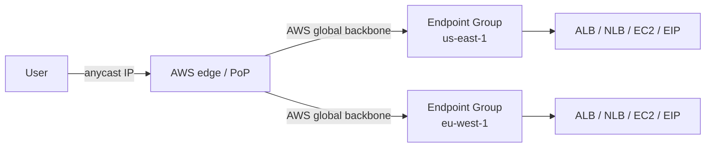

# AWS Global Accelerator

> **Global network performance + availability service using AWS's global backbone. Provides 2 static anycast IPv4 IPs (and IPv6 dual-stack) as a fixed entry point. Traffic enters at the nearest edge, traverses AWS backbone to the closest healthy regional endpoint. TCP and UDP. Sub-minute failover via health checks. Endpoint Groups + Traffic Dial for traffic shifting. Custom Routing Accelerator for gaming / EUC. Shield Standard included.**

Maps to: **Domain 1.1 — Network connectivity**, **Domain 1.3 — Reliable / resilient**, **Domain 2.4 — High-performance**

---

## Overview

- **2 static anycast IPv4** (and **IPv6 dual-stack**) — fixed entry point
- **BYOIP** — bring your own IPs into GA
- Traffic enters at **nearest AWS edge** (Anycast), routed over **AWS global backbone** to closest healthy regional endpoint
- **TCP and UDP** — any protocol (HTTP, MQTT, gaming UDP, VoIP, financial trading)
- Endpoint types: **ALB, NLB, EC2 instances, Elastic IPs**
- **Sub-minute failover** via health checks
- **NOT a CDN** — doesn't cache content; routes packets

---

## When GA vs CloudFront

| Feature | **Global Accelerator** | **CloudFront** |
|---|---|---|
| Layer | L4 (TCP / UDP) | L7 (HTTP/S) |
| Caching | No | Yes |
| Static IPs | Yes (anycast) | No (DNS-based) |
| Protocols | Any TCP / UDP | HTTP/S only |
| Best for | Gaming, IoT, VoIP, financial, multi-Region failover, IP allowlisting | Web content, static + dynamic HTTP/S |

Both integrate with **AWS Shield**.

> **CloudFront does NOT provide static anycast IPs** — key GA distinction.

---

## Architecture

---

## Core Components

- **Accelerator** — top-level resource with 2 anycast IPs (or BYOIP)
- **Listener** — port / port range + protocol (TCP / UDP) + client affinity
- **Endpoint Group** — per-Region group with **Traffic Dial (0–100%)** for shifting
- **Endpoints** — ALB, NLB, EC2, Elastic IPs
- **Endpoint weight** — per-endpoint (0–255) within a group
- **Health checks** — built-in or reuse ALB / NLB target health

---

## Custom Routing Accelerator

- **Deterministic port-based routing** to specific EC2 destinations
- Use cases: **online gaming, gambling, virtual workstations / EUC**
- Map client → destination via API; consistent routing to a specific EC2
- Up to **millions of port:destination mappings** per accelerator

---

## Client IP Preservation

- Supported on **ALB + EC2** endpoints
- **NLB preserves client IP natively**
- Per-endpoint configuration

---

## Health Checks

- TCP / HTTP / HTTPS
- Reuses ALB / NLB target group health by default
- Continuous; unhealthy endpoint stops receiving traffic within seconds
- Cross-Region failover automatic via routing to next-healthy endpoint group

---

## Security

- **Shield Standard** — included free
- **Shield Advanced** — paid; SRT, cost protection, advanced reporting
- **No native WAF integration** — put WAF on the ALB target
- **TLS** end-to-end between client and backend
- **VPC origin support** — private subnet endpoints via ALB / NLB

---

## Use Cases

- **Multi-Region active-passive / active-active** with fast failover
- **Gaming** — UDP, low latency, deterministic routing
- **IoT** — MQTT, persistent TCP
- **VoIP / video conferencing** — UDP, jitter reduction
- **Financial trading** — TCP with predictable latency
- **IP allowlisting** at firewalls / partner integrations
- **Replace Route 53 latency-based routing** when sub-minute failover + static IPs needed (Route 53 DNS TTL min ~60 s)

---

## Pricing

- Per-accelerator hourly fee (~$0.025/hr)
- Data transfer over AWS backbone (priced by source / destination Region)
- Generally cheaper than self-managed cross-Region routing

---

## Exam Tips

- "Static IPs + multi-Region failover for TCP / UDP" → **Global Accelerator** (NOT CloudFront)
- "Anycast routing through AWS backbone" → **Global Accelerator**
- "Low latency for gaming / IoT / VoIP" → **Global Accelerator**
- "HTTP/S content caching" → **CloudFront**, NOT GA
- **Custom Routing Accelerator** for deterministic port-based routing (gaming, EUC)
- **BYOIP** keeps existing IPs after migration
- **IPv6 dual-stack**
- **Sub-minute failover** — faster than Route 53 DNS-based
- **Endpoint Group Traffic Dial** for traffic shifting (canary, blue/green)
- **No WAF integration directly** — put WAF on the ALB target
- **Client IP preservation** on ALB / EC2 / NLB endpoints
- **Cross-account endpoints** supported

---

## Exam Traps

- **Global Accelerator is NOT a CDN** — does NOT cache
- **CloudFront has its own Anycast Static IPs** but for static IP + L4 routing → GA is still the canonical answer
- **No native WAF integration on GA** — put WAF on the ALB target
- **Traffic Dial is per-endpoint group, NOT per-endpoint** — use endpoint weights for per-endpoint shifting
- **GA does NOT replace Route 53** — Route 53 still resolves DNS to the GA anycast IPs; GA only handles packet routing
- **Custom Routing Accelerator is a separate accelerator type** — cannot mix with standard routing
- **Health checks on ALB / NLB endpoints reuse target group health** — don't double-configure
