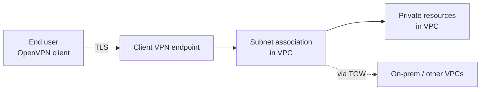
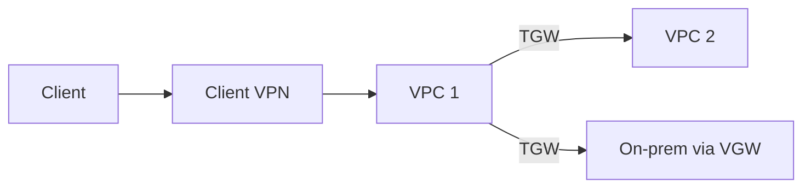

# AWS Client VPN

> **Managed, OpenVPN-based remote-access VPN. End users connect from laptops / mobiles to a VPC (and optionally on-prem via VGW/TGW). Three auth methods: Active Directory, Mutual TLS certificates, SAML SSO. Split tunnel (default — only VPC traffic) vs full tunnel (all traffic via VPN for inspection). Self-service portal (Sep 2024). Client connect handler (Lambda) for runtime connection control.**

Maps to: **Domain 1.1 — Hybrid connectivity (remote access)**, **Domain 1.2 — Security controls**

---

## Overview

- **OpenVPN-based** managed VPN endpoint
- Use cases: remote workforce → VPC private resources, contractor access, on-prem via TGW
- **No custom VPN server / bastion host needed**
- **Scales with connected users**
- Integrates with **VGW** (on-prem), **TGW** (multi-VPC), **Route 53 Resolver** (DNS)
- **IPv4** only (IPv6 routing through tunnel NOT supported as of 2026)

---

## Architecture

---

## Authentication

| Method | When |
|---|---|
| **Mutual TLS (mTLS)** | Per-user certs via ACM Private CA; no AD |
| **Active Directory** | Username / password against AWS Managed AD or on-prem AD (AD Connector); MFA via Radius |
| **Federated SSO (SAML 2.0)** | Okta, Azure AD, OneLogin; MFA via IdP |

All methods can be combined with **client certificate** as a second factor.

---

## Split Tunnel vs Full Tunnel

| Mode | Traffic |
|---|---|
| **Split tunnel** (default) | Only VPC CIDRs + explicit routes via VPN; rest direct to internet |
| **Full tunnel** | ALL client traffic via VPN — for inspection / DLP |

### Full tunnel pattern

- Disable split tunneling on the endpoint
- Route **0.0.0.0/0** via VPN
- Use case: security team requires inspecting all client traffic

> **Don't add 0.0.0.0/0 to route table while split tunnel is enabled** — modifying the route table in split-tunnel mode **resets all active connections**.

---

## Components

- **Client VPN endpoint** — entry point
- **Client CIDR** — IP range for clients (e.g., 10.0.0.0/22)
- **Subnet associations** — VPC subnets the endpoint can reach (one ENI per subnet)
- **Authorization rules** — control which CIDRs each user / group can reach
- **Route table** — additional CIDRs (on-prem via VGW, other VPCs via TGW, 0.0.0.0/0)
- **Self-service portal (Sep 2024)** — managed web UI for users to download configs
- **Client connect handler (2021+)** — Lambda invoked per connection for allow / deny
- **Client login banner** — custom message at connect time

---

## Authorization

- Authorization rules grant **specific users / groups** access to **specific CIDRs**
- Combine with **VPC SGs** and **NACLs** for in-VPC controls
- On-prem access: VGW or TGW attached to the VPC; routes both ways

---

## Multi-VPC / On-Prem

Endpoint attaches to **one VPC**; other VPCs / on-prem reached via TGW.

---

## Self-Service Portal (Sep 2024)

- Managed web UI for users to download VPN config + client
- Eliminates manual cert / config distribution
- SAML federated login

---

## Client Connect Handler (Lambda, 2021+)

- Lambda invoked on connection establishment
- Use cases:
  - Device posture check (managed devices only)
  - Time-of-day restriction
  - Custom risk scoring
- Returns ALLOW or REJECT with optional message

---

## Security

- **TLS end-to-end** between client and endpoint
- **ACM Private CA** for mutual TLS certs
- **CloudWatch Logs + CloudTrail** for connection + API audit
- **Session timeout** + **client connect handler** for layered controls

---

## Pricing

- **Endpoint association**: ~$0.10/hr per subnet
- **Active client connection**: ~$0.05/hr per connection
- Plus standard data transfer
- Pay-per-use

---

## Client VPN vs Site-to-Site VPN

| Feature | **Client VPN** | **Site-to-Site VPN** |
|---|---|---|
| Endpoint | End user laptop / mobile | On-prem router (CGW) |
| Protocol | OpenVPN | IPsec |
| Use case | Remote workforce | Network-to-network |
| Auth | mTLS, AD, SAML | PSK, certificates |
| Scaling | Per-user pricing | Per-tunnel pricing |

---

## Exam Tips

- "Remote workforce VPN to AWS / on-prem" → **AWS Client VPN**
- "OpenVPN-based managed remote access" → **AWS Client VPN**
- **3 auth types**: AD, mutual TLS (ACM Private CA), SAML SSO
- **Split tunnel default**; **full tunnel** when inspection required (route 0.0.0.0/0)
- **Self-service portal (Sep 2024)** for user config download
- **Client connect handler (Lambda)** for runtime allow / deny per connection
- **Reach on-prem via VGW / TGW** — attach endpoint to a VPC with connections
- **Authorization rules** restrict CIDR access per user / group
- **Per-user pricing**
- **ACM Private CA** for per-user client certs

---

## Exam Traps

- **Client VPN ≠ Site-to-Site VPN** — Client = end users; S2S = network-to-network
- **IPv6 routing through tunnel NOT supported** as of 2026
- **Modifying route table in split-tunnel mode resets all active connections** — switch to full-tunnel first
- **Authorization rules are mandatory** for VPC access — even with a route
- **Endpoint attaches to one VPC** — multi-VPC via TGW
- **Self-service portal does NOT issue certificates** — distributes pre-issued configs
- **Client connect handler must return quickly** — long Lambdas delay user connection
- **MFA requires AD + Radius** OR SAML IdP — not native to mTLS
