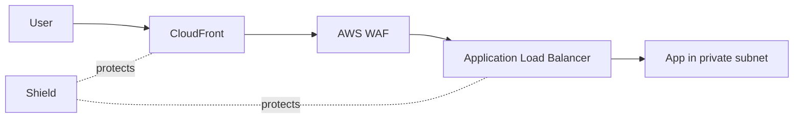

# AWS Shield

> **Managed DDoS protection. Shield Standard (free, always-on) protects all AWS resources from common L3/L4 attacks. Shield Advanced (~$3,000/mo per Organization) adds L3-L7 protection, 24/7 DDoS Response Team (DRT), cost protection, health-based detection, and auto-mitigation via WAF for protected resources (CloudFront, ALB, NLB, Elastic IPs, Global Accelerator, Route 53).**

Maps to: **Domain 1.2 — Security controls**, **Domain 1.1 — Edge security**, **Domain 2.3 — New workload security**

---

## Shield Standard (free, automatic)

- **Always-on**, free, no opt-in
- Protects **all AWS customers** against common L3/L4 DDoS:
  - SYN/ACK floods
  - UDP reflection
  - Slow loris (limited)
- Best paired with **CloudFront, Route 53, Global Accelerator** at the edge

---

## Shield Advanced (~$3,000/mo per Organization)

- **L3 / L4 / L7** DDoS protection
- **24/7 DDoS Response Team (DRT)**
- **Cost protection** — waivers for DDoS-induced auto-scaling
- **Health-based detection** — Route 53 health checks for app-aware mitigation
- **Auto L7 DDoS mitigation** — creates / deploys WAF rules automatically
- **WAF included** with Shield Advanced subscription
- **Protected resources**:
  - CloudFront distributions
  - Route 53 hosted zones
  - ALB
  - **NLB**
  - Elastic IPs (EC2 / NAT / NLB)
  - Global Accelerator
- **Network Security Director** — central console for incidents + mitigation reports

---

## DDoS Attack Types

| Layer | Examples | Mitigation |
|---|---|---|
| **L3 (Network)** | SYN flood, UDP reflection, IP frag | Shield Standard |
| **L4 (Transport)** | TCP / UDP state exhaustion | Shield Standard |
| **L7 (Application)** | HTTP flood, slow attack | **Shield Advanced + WAF rate-based** |

---

## Shield Advanced CloudWatch Metrics

- **`DDoSDetected`** — event on a resource
- **`DDoSAttackBitsPerSecond`** — volume
- **`DDoSAttackPacketsPerSecond`** — PPS
- **`DDoSAttackRequestsPerSecond`** — L7 rate
- Alarm + SNS for runbook automation

---

## AWS DDoS Resiliency Best Practices (BP1–BP7)

| BP | Service / Pattern |
|---|---|
| **BP1: Edge delivery** | CloudFront, Global Accelerator |
| **BP2: Detect + filter** | WAF, CloudFront managed rules |
| **BP3: DNS at edge** | Route 53 + DNS Firewall |
| **BP4: Obfuscate origins** | CloudFront / ALB / API Gateway in front |
| **BP5: Filter L3/L4** | SGs + NACLs |
| **BP6: Reduce attack surface** | Shield Advanced on protected resources |
| **BP7: Scale to absorb** | EC2 Auto Scaling, Lambda concurrency |

---

## Architecture Pattern

---

## When to upgrade to Shield Advanced

- High-value, public-facing workloads (financial, gaming, e-commerce)
- Need 24/7 DRT support
- Cost protection against DDoS auto-scaling
- Auto-L7 mitigation via WAF

---

## Pricing

- **Shield Standard**: free
- **Shield Advanced**: ~$3,000/month per AWS Organization (1-yr commit) + data transfer
- **WAF included** with Shield Advanced

---

## Exam Tips

- **Standard** = free, L3/L4, automatic
- **Advanced** = L3-L7, DRT, cost protection, health-based detection, auto-WAF
- **Advanced protected resources**: CloudFront, Route 53, ALB, **NLB**, Elastic IPs, Global Accelerator
- **WAF included with Shield Advanced subscription**
- **24/7 DRT** with Advanced
- **Cost protection** covers DDoS-induced auto-scaling
- "Block DDoS attacks" → **Shield** (NOT WAF — WAF for L7 exploits)
- "L7 DDoS auto-mitigation" → **Shield Advanced auto-WAF**
- **CloudFront + Shield + WAF + Route 53** = standard DDoS-resilient edge perimeter
- **Network Security Director** = central console

---

## Exam Traps

- **Shield for DDoS; WAF for web exploits** — different services
- **Standard does NOT protect L7** — must use Advanced for L7 DDoS
- **Advanced is ~$3,000/mo per Organization** (1-yr commit)
- **Advanced protected resources are explicit** — not all AWS resources auto-protected
- **EC2 alone is NOT directly Shield-protected** — must be behind ALB / EIP / CloudFront / GA
- **NLB protection now supported** — old material may say it's not
- **Advanced subscription is per Organization**, not per account
- **DDoS cost protection requires Shield Advanced** — Standard doesn't include it
