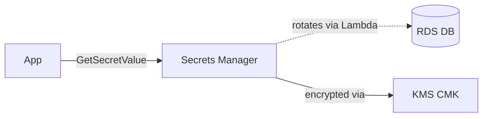
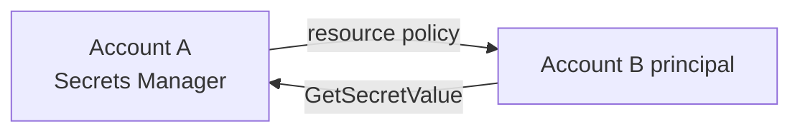

# AWS Secrets Manager

> **Managed secrets store with automatic rotation for DB credentials, API keys, OAuth tokens, SSH keys. Encrypted at rest with KMS. Native rotation for RDS, Aurora, Redshift, DocumentDB. Cross-account access via resource policies. Multi-Region replication. BatchGetSecretValue. Parameters and Secrets Lambda Extension for cached retrieval. Paid (~$0.40/secret/mo + API calls). Use for credentials needing lifecycle; for plain config use Parameter Store.**

Maps to: **Domain 1.2 — Security controls**, **Domain 2.3 — New workload security**

---

## Overview

- Managed secrets store with built-in lifecycle management
- **At rest**: KMS (AWS-managed `aws/secretsmanager` or customer-managed CMK)
- **In transit**: TLS
- JSON blobs up to **64 KB**
- **Fine-grained access** via IAM + resource policies
- **CloudTrail** logs every access
- Common types: DB credentials, API keys, OAuth tokens, mTLS certs, SSH keys

---

## When Secrets Manager vs Parameter Store

| Need | Service |
|---|---|
| **Automatic rotation** | **Secrets Manager** |
| Plain config / non-rotating | **Parameter Store** (cheaper) |
| Cross-account secret sharing | **Secrets Manager** (resource policies) |
| Hierarchical config tree | **Parameter Store** |
| Free tier | **Parameter Store** (Standard) |

> Parameter Store can **reference** Secrets Manager via `/aws/reference/secretsmanager/<name>`.

---

## Automatic Rotation

- Rotation uses a **Lambda function** to update credentials
- **Native rotation templates** for:
  - **RDS** (MySQL, PostgreSQL, MariaDB, Oracle, SQL Server)
  - **Aurora** (MySQL, PostgreSQL)
  - **Redshift**
  - **DocumentDB**
- **Custom rotation** via your own Lambda for anything else
- **Strategies**:
  - **Single user** — same user, password rotated in place
  - **Alternating users** — two users; zero-downtime
- **Schedule** — every 1+ days
- **Manual rotation** via `RotateSecret` API

> When rotation is enabled, Secrets Manager immediately rotates ONCE to validate — ensure apps already read from Secrets Manager BEFORE enabling.

---

## Multi-Region Replication

- Replicate to multiple Regions
- **Primary + replicas** (replicas read-only)
- **Promote replica to primary** for DR
- Replicas re-encrypted with destination KMS key
- Use case: multi-Region apps, cross-Region failover

---

## Cross-Account Access

- **Resource policy** on the secret + IAM policy on the cross-account principal
- Avoid AssumeRole when direct access suffices
- Pattern: shared services account hosts secrets; workload accounts read directly

---

## Integration Patterns

- **RDS / Aurora console** — "managed in Secrets Manager" option
- **CloudFormation** — `AWS::SecretsManager::Secret` + `SecretTargetAttachment` linking to RDS
- **ECS / Fargate** — task defs fetch secrets at start (env vars)
- **EKS** — External Secrets Operator / Secrets Store CSI Driver
- **Lambda** — SDK OR **Parameters and Secrets Lambda Extension** (cached, 5-min TTL default)

---

## BatchGetSecretValue

- Retrieve **up to 20 secrets in one API call**
- Reduces latency + API count for apps with many secrets at startup

---

## Pricing

- **$0.40/secret/month**
- **$0.05 per 10,000 API calls**
- Each multi-Region replica counts as a separate secret
- CMK has standard KMS pricing

---

## Common Patterns

### RDS with Secrets Manager rotation

### Cross-account secret access

### Lambda + Parameters and Secrets Extension

- Lambda Extension caches secrets in execution environment
- Default 5-min TTL — reduces API calls + cold-start latency
- HTTP `localhost:2773` endpoint inside Lambda

---

## Exam Tips

- **Secrets Manager = secrets with rotation**; Parameter Store = config (no rotation)
- **Native rotation** for RDS, Aurora, Redshift, DocumentDB
- **Custom rotation** via Lambda for anything else
- **Alternating users** = zero-downtime rotation
- **Multi-Region replication** for DR + multi-Region apps
- **Cross-account via resource policies** (preferred over AssumeRole)
- **BatchGetSecretValue** — 20 secrets in one call
- **Parameters and Secrets Lambda Extension** caches in Lambda
- **Parameter Store can reference Secrets Manager** via `/aws/reference/secretsmanager/<name>`
- **CloudTrail-audited** — every access logged
- KMS encrypted by default (AWS-managed or CMK)

---

## Exam Traps

- **Secrets Manager is NOT free** (~$0.40/secret/mo + API calls) — Parameter Store Standard is free
- **Rotation triggers immediate test rotation** — apps must already read from Secrets Manager
- **Multi-Region replicas are read-only** — promote to write
- **Cross-account requires BOTH** resource policy + principal IAM policy
- **Native rotation templates exist only for** RDS / Aurora / Redshift / DocumentDB
- **KMS CMK access required** for both principal AND secret resource policy in cross-account
- **64 KB max payload** — large secrets must be split
- **Parameter Store SecureString ≠ Secrets Manager** — lacks rotation + replication
