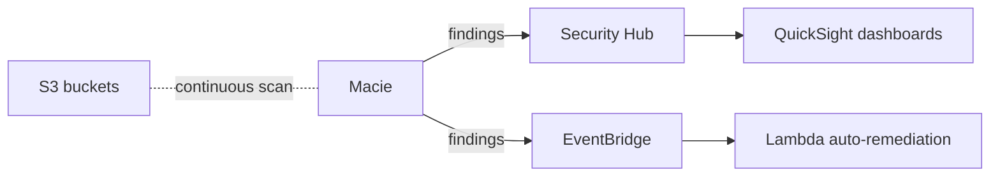

# Amazon Macie

> **Managed sensitive-data discovery service for Amazon S3. ML + pattern matching identifies PII, credentials, financial data, healthcare data. Automated discovery continuously scans your S3 estate. 100+ managed data identifiers + custom identifiers + Allow Lists. Findings flow to Security Hub, EventBridge, Security Lake. Multi-account via Organizations with delegated administrator.**

Maps to: **Domain 1.2 — Security controls**, **Domain 1.2 — Compliance**, **Domain 3.3 — Improve security**

---

## Overview

- **ML-powered** sensitive-data discovery in **S3**
- PII, credentials, financial data, healthcare data, IP
- Continuous + on-demand discovery
- Findings → **Security Hub, EventBridge, Security Lake, S3**
- Multi-account via **Organizations** with delegated admin
- Available in most commercial Regions

---

## What Macie Detects

- **PII**: SSN, address, name, driver's license, passport, phone
- **Credentials**: AWS access keys, private keys (RSA, OpenSSH), API tokens
- **Financial**: credit card, bank account, SWIFT
- **Healthcare**: HIPAA (DOB, medical record numbers, NPI)
- **Custom** (your patterns)

---

## Managed Data Identifiers

- **100+ pre-built** identifiers for common sensitive types
- Maintained by AWS — improved + new types over time

---

## Custom Data Identifiers

- User-defined detection logic
- **Regex + keywords + proximity rules**
- Use case: org-specific employee IDs, customer account formats
- **Allow Lists** — text patterns to **ignore** (e.g., public phone numbers, sample data)

---

## Discovery Modes

### Automated Sensitive Data Discovery

- **Continuous, low-cost** scanning of entire S3 estate
- Samples + analyzes objects
- Builds **resource profiles** (per-bucket sensitivity score)
- Recommended for posture monitoring

### Discovery Jobs (one-time / scheduled)

- More thorough scans of specific buckets / objects
- For compliance audits, incident response

---

## Findings

- **Severity** (Low / Medium / High / Critical)
- Resource, timestamp, sample (no sensitive data in payload — only metadata)
- **90-day retention** in Macie console; export to S3 for longer
- Types:
  - **Policy findings** — S3 misconfigurations (`Policy:IAMUser/S3BucketEncryptionDisabled`, `S3BucketPublic`)
  - **Sensitive Data findings** — actual sensitive data
- **Suppression rules** — auto-archive false-positive patterns

---

## Multi-Account (Organizations)

- **Delegated administrator** (any Org account) manages Macie org-wide
- Centralized findings
- Member accounts onboarded via Organizations OR invitation

---

## Integration

- **Security Hub** — aggregate with GuardDuty / Inspector / Config
- **EventBridge** — trigger Lambda / Step Functions on findings
- **Security Lake** — long-term Iceberg storage for SIEM
- **CloudTrail data events** — power access-pattern analysis
- **S3** — store discovery results + sample findings

---

## Pricing

- **Automated discovery**: per-GB scanned (tiered)
- **Discovery jobs**: per-GB + per-object
- **Daily S3 inventory evaluation**: included
- Significantly cheaper than earlier versions of Macie

---

## Common Patterns

### Continuous compliance monitoring

### Multi-account org-wide discovery

- Delegate Macie admin to security account
- All member accounts auto-onboarded
- Findings aggregated in delegated admin

### Auto-remediation

- Macie finds public bucket with PII
- EventBridge → Lambda
- Lambda updates bucket policy / S3 Block Public Access

---

## Exam Tips

- "Discover sensitive data in S3" → **Macie**
- "PII / credentials / financial data classification" → **Macie**
- "Automated continuous discovery" → **Macie Automated Sensitive Data Discovery**
- "Multi-account from a single console" → **Macie + delegated administrator**
- **Custom data identifiers** for org patterns + **Allow Lists** for ignores
- Findings → **Security Hub, EventBridge, Security Lake**
- "S3 misconfiguration detection" → Macie **Policy findings**
- 90-day finding retention; export to S3 for longer
- **CloudTrail data events** power access-pattern analysis

---

## Exam Traps

- **Macie is S3-only** — does NOT scan EBS, RDS, DynamoDB (use Inspector / GuardDuty)
- **Macie does NOT remediate** — only detects; build EventBridge + Lambda for auto-remediation
- **Findings have 90-day retention** — export to S3 for archive
- **Automated discovery samples** — for full coverage use discovery jobs
- **Delegated administrator can be any Org account** — not just management
- **Macie ≠ DLP gateway** — detects + alerts; does NOT block uploads in flight
- **Multi-account via Organizations** is far simpler than invite-based
