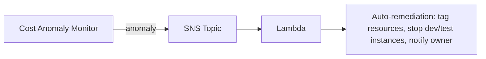

# AWS Cost Anomaly Detection

> **ML-based service that detects unusual spend patterns across AWS services. Free. Three monitor types: AWS services, Linked accounts, Cost categories, Cost allocation tags. Alerts via email or SNS for downstream automation. Detection sensitivity tunable (>$100, >$500, etc.). Pairs with Cost Explorer + Budgets for the cost-management triad.**

Maps to: **Domain 1.5 — Cost optimization + visibility**, **Domain 3.5 — Improve cost**

---

## Overview

- **ML-based anomaly detection** on AWS spend
- **Free service**
- Detects **unusual spend patterns** vs historical baseline
- Alerts via **email** or **SNS** (for Lambda / Slack / PagerDuty automation)
- Multi-account via AWS Organizations (management account or delegated admin)

## Monitor Types

| Type | What it watches |
|---|---|
| **AWS services** | All services (or specific list) |
| **Linked accounts** | Specific Organization accounts |
| **Cost categories** | Custom groupings from Cost Explorer |
| **Cost allocation tags** | Per-tag spend |

> Up to **500 monitors per account**.

## Alert Subscriptions

- **Threshold**: minimum dollar impact to trigger (e.g., > $100, > $500)
- **Frequency**: daily, weekly, individual alerts
- **Recipients**: email addresses or SNS topic

## How It Works

1. Macie ingests historical spend (8+ weeks)
2. Builds **per-monitor baseline** with seasonality
3. Continuously compares actual vs predicted
4. Generates **anomaly** when actual significantly deviates
5. Notifies subscribers

## Anomaly Report

- **Total impact** (dollar amount + percentage)
- **Root cause analysis**: services / regions / accounts contributing
- **Suggested investigation steps**

## Integration with Other Cost Tools

| Service | Role |
|---|---|
| **Cost Anomaly Detection** | Detect unusual spend (ML, free) |
| **AWS Budgets** | Threshold alerts (you set the limits) |
| **Cost Explorer** | Visualize + forecast |
| **Cost & Usage Report (CUR)** | Detailed line-item dump |
| **Cost Optimization Hub** | Consolidated recommendations |

## Common Patterns

### Triad of cost management

1. **Budgets** — fixed thresholds for known expected spend
2. **Cost Anomaly Detection** — ML for unexpected drift
3. **Cost Explorer** — investigate when alerted

### Auto-remediation flow

## Pricing

- **Free** — no service charge
- Pay for downstream notification destinations (SNS messages, etc.)

## Exam Tips

- "Detect unusual / unexpected AWS spend automatically" → **Cost Anomaly Detection**
- **Free service**
- **ML-based** with per-monitor baseline + seasonality
- **Monitor types**: AWS services, linked accounts, cost categories, tags
- **Alerts via email or SNS** (SNS → Lambda → automation)
- **Threshold** ($100, $500, etc.) to filter low-impact noise
- **Org-wide** with delegated administrator
- Use with **Budgets** (known thresholds) + **Cost Explorer** (investigation) = full cost triad

## Exam Traps

- **Cost Anomaly Detection ≠ AWS Budgets** — Budgets uses fixed thresholds (you set); Anomaly Detection uses ML
- **Detection takes time** — requires 8+ weeks of historical data per monitor
- **Anomalies are not real-time** — daily evaluation
- **SNS topic for alerts must allow Cost Anomaly Detection service principal** to publish
- **Multi-account via Organizations** requires management account or delegated admin
- **Per-tag monitors require cost allocation tags to be activated** in Billing Console
