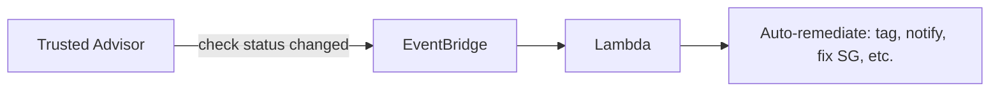

# AWS Trusted Advisor

> **Automated best-practice checks across 5 pillars: Cost Optimization, Performance, Security, Fault Tolerance, Service Limits. Free tier (basic checks) and Business / Enterprise Support tiers (all 200+ checks). Findings published to AWS Health Dashboard, integrated with EventBridge for automation. Now part of Cost Optimization Hub (cost) + Security Hub (security checks). Use for ongoing posture monitoring vs spec evaluations.**

Maps to: **Domain 1.5 — Cost optimization**, **Domain 3.3 — Improve security**, **Domain 3.1 — Improve reliability**

---

## Overview

- **Automated best-practice checks** across the AWS account / Organization
- Provides **specific actionable recommendations**
- **Five pillars**:
  - **Cost Optimization** — idle instances, underutilized resources
  - **Performance** — high-utilization instances, throughput optimization
  - **Security** — public S3 buckets, MFA on root, security group rules
  - **Fault Tolerance** — Multi-AZ deployments, snapshot age
  - **Service Limits** — usage approaching service quotas
- **API** + **EventBridge** integration for automation

## Tier Availability

| Tier | Checks |
|---|---|
| **Basic / Developer** | ~7 checks (limited security + service limits) |
| **Business / Enterprise / Enterprise On-Ramp Support** | **All 200+ checks** + API access |

> **Business Support plan or higher** is required for the full Trusted Advisor experience.

## Notable Checks (full tier)

### Cost

- Underutilized EC2 instances
- Idle load balancers
- Underutilized EBS volumes
- Unassociated Elastic IPs
- Low-utilization RDS DB instances
- Idle Redshift clusters
- Savings Plans / Reserved Instance recommendations

### Performance

- High utilization EC2 instances
- Service limit close to quota
- CloudFront content delivery optimization
- EBS provisioned IOPS optimization

### Security

- MFA on root user
- IAM Access Key rotation
- Security Group rules with broad access (0.0.0.0/0 on sensitive ports)
- S3 bucket permissions (public)
- Root account MFA, password policy
- CloudTrail logging enabled
- IAM Use (avoid root)

### Fault Tolerance

- Auto Scaling groups misconfigured
- Multi-AZ on RDS
- EBS snapshot age
- ELB / target group health
- Route 53 health checks

### Service Limits

- Approaching service quotas (EC2 instances, EBS volumes, ELBs, VPCs, etc.)

## Integration

- **EventBridge** — fire on check status change (auto-remediation pattern)
- **AWS Health Dashboard** — surfaces findings
- **Security Hub** — security-focused checks ingested
- **Cost Optimization Hub** — aggregates cost checks
- **AWS Organizations** — Trusted Advisor recommendations org-wide via delegated administrator

## Common Patterns

### Auto-remediation

### Org-wide best practice posture

- Delegate Trusted Advisor administrator to security account
- All accounts checked from a single dashboard

### Weekly cost / security review

- Trusted Advisor exports → Slack via Lambda
- Team reviews unaddressed recommendations

## Trusted Advisor vs Other Services

| Service | Role |
|---|---|
| **Trusted Advisor** | Rule-based best-practice checks across 5 pillars |
| **Compute Optimizer** | ML-driven right-sizing (deeper than TA for compute) |
| **Cost Explorer** | Visualize + forecast spend |
| **Cost Anomaly Detection** | ML-based unusual spend detection |
| **Security Hub** | Continuous CSPM checks (FSBP, CIS, PCI, NIST) |
| **AWS Config** | Resource configuration history + rules |
| **Well-Architected Tool** | Spec-based workload evaluation (not continuous) |

> Trusted Advisor = ongoing **posture monitoring**; Well-Architected Tool = point-in-time **architectural review**.

## Pricing

- **Basic / Developer Support**: 7 checks free
- **Business / Enterprise Support**: all checks included in support plan cost
- No separate Trusted Advisor charge

## Exam Tips

- **Trusted Advisor = rule-based best-practice checks** (5 pillars)
- **Business / Enterprise Support** required for the full check set + API
- **EventBridge integration** for auto-remediation
- **AWS Organizations** support — delegate admin
- **Cost Optimization Hub** aggregates Trusted Advisor + Compute Optimizer + Cost Explorer
- "Idle / underutilized resources for cost savings" → **Trusted Advisor** (basic) or **Compute Optimizer** (ML-driven, deeper)
- "Service limit / quota approaching" → **Trusted Advisor service limit checks** OR **Service Quotas** for real-time
- "MFA on root, public S3 buckets" → **Trusted Advisor security pillar** OR **Security Hub**
- **Well-Architected Tool ≠ Trusted Advisor** — WA Tool is workload-spec; TA is continuous account checks

## Exam Traps

- **Most checks require Business / Enterprise Support** — Basic tier has only 7
- **Trusted Advisor is NOT a SIEM** — it's best-practice scanning; for threat detection use **GuardDuty** + **Security Hub**
- **Trusted Advisor is rule-based**, NOT ML-driven — for ML right-sizing use **Compute Optimizer**
- **Trusted Advisor doesn't replace AWS Config** — Config tracks state changes + rules; TA flags posture issues
- **Cost Optimization Hub** is the consolidated recommendations view across TA / Compute Optimizer / Cost Explorer
- **Service Quotas service** is the modern way to manage quota requests — TA flags approaching limits but Service Quotas handles increases
