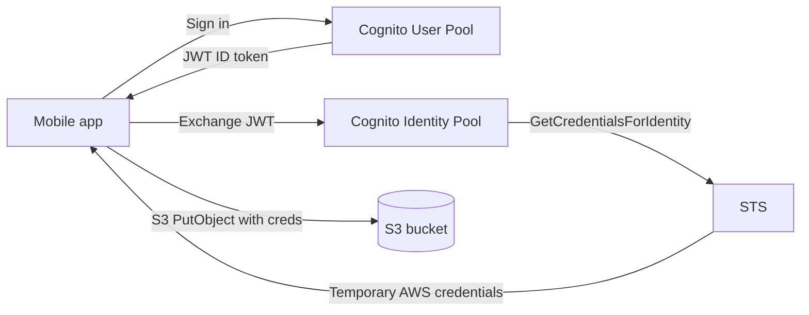

# Amazon Cognito

> **Managed identity service for web/mobile apps. User Pools = user directory with sign-up/sign-in + OAuth2/OIDC. Identity Pools = federated identity broker that hands back temporary IAM credentials for AWS resource access. Supports social/SAML/OIDC federation, MFA, advanced security (compromised-credential detection, adaptive risk), and Lambda triggers for custom auth flows. The default answer for "sign in to my app" or "let mobile users access S3/DynamoDB without long-lived keys" on SAP-C02.**

Maps to: **Domain 1.2 — Prescribe security controls**, **Domain 4.3 — Modernization**

---

## Two Cognito Components — Don't Confuse Them

| Component | Purpose | Returns |
|---|---|---|
| **User Pool** | User directory (sign-up, sign-in, MFA, password policy) | JWT tokens (ID, Access, Refresh) |
| **Identity Pool** (Federated Identities) | Identity broker that exchanges any auth token for temporary AWS credentials | AWS Access Key + Secret + Session Token via STS |

> They are **independent services** that can be used separately or together. The classic pattern is **User Pool → Identity Pool → AWS resources**.

---

## Cognito User Pools

### Overview

- **Fully managed user directory** for web / mobile / API apps
- OAuth2 / OIDC compliant; issues **JSON Web Tokens (JWT)**
- Built-in **sign-up, sign-in, MFA, password reset, account recovery, email/phone verification**
- **Hosted UI** for sign-in / sign-up screens (customizable)
- Up to **40 million users per pool** (soft limit)
- **Per-Region** — multi-Region replication via Cognito User Pool global tables is not native (replicate via Lambda triggers)

### Authentication Flows

- **USER_SRP_AUTH** — Secure Remote Password (recommended, password never sent)
- **USER_PASSWORD_AUTH** — username + password (less secure; require TLS)
- **REFRESH_TOKEN_AUTH** — exchange refresh token for new ID/access tokens
- **CUSTOM_AUTH** — Lambda-driven custom flow (e.g., passwordless, OTP, captcha)
- **ADMIN_NO_SRP_AUTH** — admin-only flow (server-side)

### Federation Options

User Pools can federate **upstream** identity providers and act as a single token issuer:

- **Social providers**: Google, Facebook, Apple, Amazon
- **SAML 2.0 IdPs**: ADFS, Okta, Azure AD, Ping, OneLogin
- **OIDC IdPs**: any OIDC-compliant provider
- **Custom**: SAML / OIDC for enterprise SSO

> The user signs in with the upstream IdP; Cognito issues its own JWT that the app trusts.

### MFA Options

- **SMS** (legacy — Cognito charges for SMS)
- **TOTP** (Google Authenticator, Authy, etc.)
- **WebAuthn / passkeys** — phishing-resistant FIDO2 keys + platform authenticators
- **MFA enforcement**: OFF, OPTIONAL, REQUIRED

### Advanced Security Features

- **Compromised credentials check** — blocks users whose credentials appear in known breaches
- **Adaptive authentication** — risk-based MFA prompt based on device, IP, geolocation
- **Account takeover protection** — block / require-MFA on anomalous sign-ins
- **Lambda triggers** for custom risk logic
- Requires **Cognito Plus tier** (formerly Advanced Security)

### Lambda Triggers (Custom Auth & Hooks)

- **Pre sign-up** — validate / auto-confirm users
- **Post confirmation** — provision resources, send welcome email
- **Pre authentication** — block sign-in (e.g., geo restriction)
- **Post authentication** — analytics, audit log
- **Pre token generation** — inject custom claims into JWT
- **Migrate user** — lazy migration from another user store
- **Define / create / verify auth challenge** — passwordless, captcha, MFA custom flows

### Pricing Tiers

| Tier | Features | Cost |
|---|---|---|
| **Cognito Lite** | Basic sign-in/up, no advanced security | $0 up to 10,000 MAU, then ~$0.0055/MAU |
| **Cognito Essentials** | Hosted UI, social federation | ~$0.015/MAU |
| **Cognito Plus** | Advanced Security (compromised creds, adaptive auth) | ~$0.05/MAU |

> MAU = Monthly Active User (any user with a sign-in event in the month)

### User Pool JWT Tokens

- **ID Token** — identity claims (email, name, custom attributes); short-lived
- **Access Token** — for accessing APIs (scopes); short-lived
- **Refresh Token** — long-lived (default 30 days), used to get new ID + Access tokens
- All tokens are signed with the **User Pool's RSA key**; backend / API GW verifies via `jwks.json`

### API Gateway Integration

- **Cognito Authorizer** — REST API GW validates User Pool tokens natively (no Lambda authorizer needed)
- **JWT Authorizer** (HTTP API GW) — validates User Pool JWT
- Use **scopes** (Access Token) for fine-grained method-level authorization

---

## Cognito Identity Pools (Federated Identities)

### Overview

- **Identity broker** — exchange a federated identity token (Cognito User Pool, Google, Facebook, SAML, OIDC, custom) for **temporary AWS credentials** via STS
- Used by mobile / web / IoT clients to access S3, DynamoDB, Lambda, etc. directly with **least-privilege IAM roles**
- Supports **authenticated** and **guest (unauthenticated)** users

### Identity Sources

- **Cognito User Pool** (most common)
- **Social**: Google, Facebook, Apple, Amazon
- **SAML 2.0 IdP**
- **OIDC provider**
- **Developer-authenticated identities** — custom token issued by your own backend
- **Guest users** — anonymous access (separate guest role with limited permissions)

### IAM Role Mapping

- **Default role** for authenticated users (e.g., S3 read all `myapp-uploads/*`)
- **Default role** for guests (e.g., S3 read public assets)
- **Role-based rules** — pick role based on JWT claim (e.g., `cognito:groups`)
- **Token claims → IAM policy variables** — `${cognito-identity.amazonaws.com:sub}` lets a policy scope S3 prefix to that user's identity ID

### Classic Pattern — Mobile App Uploads to S3

- IAM role policy can scope writes to `s3://bucket/uploads/${cognito-identity.amazonaws.com:sub}/*`
- Each user can only read/write their own prefix

---

## User Pool vs Identity Pool — Use Cases

| Need | Pick |
|---|---|
| Sign-up / sign-in screens for my app | **User Pool** |
| Issue JWT tokens for my API | **User Pool** |
| Federate with Google / SAML for SSO | **User Pool** (or Identity Pool for direct credential exchange) |
| Mobile app calls S3 / DynamoDB directly | **Identity Pool** (+ User Pool upstream) |
| Allow anonymous / guest access to AWS | **Identity Pool** |
| API GW Cognito authorizer | **User Pool** |
| Replace IAM users for human sign-in (long term) | **User Pool** (or **IAM Identity Center** for AWS console / CLI access) |

---

## Cognito vs IAM Identity Center vs IAM Users

| Use Case | Pick |
|---|---|
| End-user sign-in to a customer-facing app | **Cognito User Pool** |
| Mobile/web client accesses AWS resources | **Cognito Identity Pool** |
| Workforce SSO into AWS console / CLI | **IAM Identity Center** (formerly AWS SSO) |
| Service-to-service AWS API calls | **IAM Role** |
| Long-term programmatic access | **IAM Role** + STS / **IAM User** (last resort) |

---

## Multi-Region / DR Considerations

- User Pools are **Region-scoped** — no native cross-Region replication
- DR strategies:
  - **Active-active with two pools** — replicate users via Lambda triggers (`PreSignUp`, `PostConfirmation`, `Migrate User`); app picks the closest Region
  - **Backup via export** — schedule Lambda to dump user attributes to S3; restore in new Region on disaster
  - **External user store** — keep user-of-record in DynamoDB Global Table, use Cognito as a thin auth layer
- Identity Pools are also Region-scoped; replicate by creating mirrored pools per Region

---

## Security & Compliance

- All data encrypted at rest (Cognito-managed keys; not customer KMS)
- TLS in transit
- Token JWKS endpoint public — anyone can verify tokens
- **Refresh token rotation** — refresh token is replaced on each use (prevents replay)
- **PII** — sensitive attributes can be marked read/write-restricted
- **Compliance**: HIPAA eligible, PCI DSS, SOC, ISO

---

## Common Exam Scenarios

### "Mobile app, sign-in + direct S3 upload" → User Pool + Identity Pool

User signs in via User Pool → token exchanged at Identity Pool → temporary creds → S3.

### "Federate Google / Facebook into my app" → User Pool with social IdP

User Pool acts as the OAuth client to Google; app trusts only User Pool tokens.

### "Enterprise SAML SSO into my web app" → User Pool with SAML IdP

User Pool federates Azure AD / Okta / ADFS; issues its own JWT downstream.

### "API GW requires authenticated calls" → User Pool Cognito Authorizer on REST API GW (or JWT Authorizer on HTTP API GW).

### "Adaptive MFA based on risk" → Cognito Plus + Advanced Security.

### "Passwordless / passkey sign-in" → Cognito + WebAuthn.

---

## Exam Tips

- **User Pool** = directory + sign-in + JWT tokens; **Identity Pool** = exchange any token for AWS credentials
- **Federation**: User Pools can act as both **IdP (issuing tokens to your app)** and **SP (federating upstream Google/SAML/OIDC)**
- **API Gateway Cognito Authorizer** is built-in for REST API GW; HTTP API GW uses **JWT Authorizer**
- **Hosted UI** for quick OAuth2 sign-in/sign-up (customizable)
- **Adaptive auth + compromised creds** require **Cognito Plus** tier (formerly Advanced Security)
- **Passkey / WebAuthn** support — phishing-resistant MFA
- **Lambda triggers** for custom flows (passwordless, lazy migration, custom claims in JWT)
- **IAM policy variables** (`${cognito-identity.amazonaws.com:sub}`) for per-user S3 prefix isolation
- **MAU-based pricing** (tier names: Lite / Essentials / Plus)
- **User Pool ≠ IAM Identity Center** — User Pool for end-user app auth; Identity Center for workforce SSO to AWS console
- **Cognito Identity Pool** is the answer for "mobile app accesses S3 / DynamoDB directly with temp creds"

## Exam Traps

- **User Pool tokens (JWT) cannot directly call AWS APIs** — you need an Identity Pool to exchange for AWS credentials
- **Identity Pool alone has no user directory** — it's just a token broker; you still need a User Pool (or Google / SAML / OIDC IdP) as the source
- **Cognito is NOT for AWS console SSO** — use **IAM Identity Center** for workforce console access
- **User Pools are Region-scoped** with no native cross-Region replication — DR requires Lambda-based sync
- **SMS MFA costs money** (Cognito SNS charges) — TOTP / passkey is cheaper and more secure
- **Hosted UI domain** must be a Cognito-managed `*.auth.region.amazoncognito.com` subdomain or a custom domain with ACM cert in `us-east-1`
- **Refresh token rotation** is opt-in on older pools — enable to prevent replay attacks
- **Token signing keys rotate** — clients must dynamically fetch `jwks.json`; don't hard-code keys
- **User Pool group `cognito:groups` claim** is in the **ID Token**, not the Access Token — use Pre Token Generation Lambda to copy into Access Token if needed for API scopes
- **Don't confuse Cognito Sync** (deprecated) with Identity Pool — Sync is gone; use AppSync / DynamoDB for client-side data sync
- **Advanced Security Features** charge per MAU even for users who never trigger a risk event
- **Identity Pool guest access** uses a **separate IAM role** — easy to over-permission if not scoped tightly
- **Federation via SAML** requires the IdP metadata XML in User Pool config — and matching ACS URL in the IdP
- **Cognito Lite tier lacks Advanced Security** — for compromised-cred detection + adaptive auth, upgrade to Plus
- **Cognito User Pool ≠ AWS Directory Service** — User Pool is for app users; Directory Service / Managed AD is for Windows / domain-joined workloads
