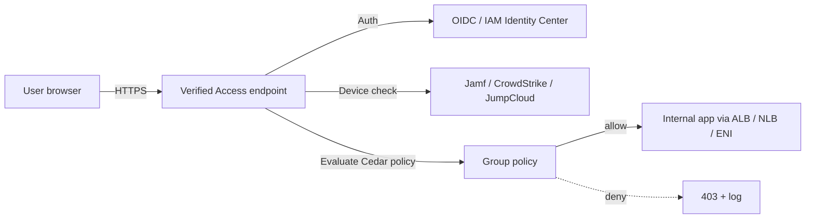

# AWS Verified Access

> **Zero-trust application access without a VPN. Evaluates every request against identity + device posture + context (geo, time, headers). Integrates with IAM Identity Center / external OIDC IdPs and third-party device trust providers (Jamf, CrowdStrike, JumpCloud). Replaces traditional VPN for HTTP/HTTPS app access. Logs every request to CloudWatch / S3 / Firehose. New SAP-C02 topic for zero-trust scenarios.**

Maps to: **Domain 1.2 — Prescribe security controls**, **Domain 3.3 — Improve security**

---

## Overview

- **Zero-trust application access** — no VPN, no IP allowlists
- **Per-request authorization** based on identity + device + context (not just "user is on the network")
- Supports **HTTP / HTTPS / TCP** apps (HTTPS most common)
- Sits in front of internal apps as a managed reverse proxy
- Removes the need for client-side VPN agents or bastion hosts for browser apps

## Core Components

### Trust providers

- **Identity trust provider**: IAM Identity Center, or any OIDC-compliant IdP (Okta, Azure AD, Ping, Auth0, etc.)
- **Device trust provider**: Jamf, CrowdStrike Falcon, JumpCloud — verifies device posture (OS version, disk encryption, EDR running)

### Verified Access Instance

- The container for trust providers + groups + policies
- One per workload or organization

### Verified Access Group

- A logical grouping of applications with **shared policies**
- E.g., "finance apps", "engineering tools"

### Verified Access Endpoint

- The actual proxy endpoint for an application
- Backed by an **ALB**, **NLB**, or **ENI** (private app target)
- Public-facing DNS hostname (TLS terminated)

### Policy (Cedar Language)

- Written in **Cedar** (same policy language as Amazon Verified Permissions)
- Evaluates: identity claims + device posture + context → allow / deny
- Example: `permit(principal, action, resource) when { context.identity.groups.contains("Finance") && context.device.compliant == true && context.http_request.geo.country == "US" };`

---

## How It Works

1. User hits the Verified Access endpoint
2. VA authenticates user via trust provider (OIDC redirect)
3. VA queries device trust provider for compliance signal
4. VA evaluates Cedar policy against identity + device + context
5. Allow → request forwarded to the backend ALB/NLB/ENI
6. Deny → 403 response + audit log

---

## Logging & Observability

- Logs every request to:
  - **CloudWatch Logs**
  - **S3** (long-term storage)
  - **Kinesis Data Firehose** (downstream SIEM)
- Log fields: identity claims, device posture, policy decision, network 5-tuple, HTTP method, URI, user-agent
- Integrates with **GuardDuty** for anomaly detection, **Security Lake** for centralized analytics

---

## Verified Access vs VPN vs Client VPN vs PrivateLink

| Scenario | Pick |
|---|---|
| Browser users access internal web apps from anywhere | **Verified Access** |
| Full network access (TCP/UDP, multiple subnets) for engineers | **Client VPN** (or Site-to-Site VPN) |
| Site-to-site office connectivity | **Site-to-Site VPN** or **Direct Connect** |
| Cross-account private service exposure | **PrivateLink** |
| Cross-account / cross-VPC TCP routing | **Transit Gateway** |
| Bastion replacement for SSM-based shell access | **Systems Manager Session Manager** |

---

## Common Patterns

### Replace Internal VPN-Protected Web App

- Before: Office workers VPN into corp network to reach internal Confluence / Jira
- After: Public Verified Access endpoint authenticates user via Okta, checks device via Jamf, forwards to internal ALB

### Conditional Access for Sensitive Apps

- Finance group + corporate-managed device + US-only IP + business hours
- Cedar policy enforces all four conditions per request

### Multi-Account App Access

- Verified Access endpoint in shared "edge" account
- Backend ALB / ENI in workload accounts via cross-account VPC routing
- Centralized policy management; per-account workload isolation

---

## Security & Compliance

- **No VPN endpoints / no public IP allowlist** — reduces attack surface
- **Per-request authorization** instead of "trust the network"
- **WAF integration** — attach WAF to the Verified Access endpoint
- **All traffic TLS-terminated** at the endpoint
- **CloudTrail** logs all VA API calls
- **HIPAA, SOC, ISO, PCI** eligible

---

## Limits & Considerations

- **HTTP / HTTPS / TCP only** — no UDP, no ICMP, no full-network access
- **TLS termination** at the endpoint — backend can be HTTP or HTTPS
- Cedar policy evaluation latency adds **single-digit ms** per request
- **DNS** — Verified Access provides a hostname; integrate with Route 53 for custom domain + ACM cert
- **Endpoint quota**: 100 per Region default; raisable
- **Per-app pricing**: $0.27/hour per endpoint + $0.01 per request (pricing varies)

---

## Exam Tips

- **Verified Access = zero-trust browser/TCP app access** without client VPN
- Trust providers: **IAM Identity Center** or any OIDC IdP (Okta, Azure AD); **Jamf / CrowdStrike / JumpCloud** for device posture
- **Cedar policy language** (same as Amazon Verified Permissions)
- Endpoint can front **ALB, NLB, or private ENI**
- Logs to **CloudWatch / S3 / Firehose**
- **WAF** can be attached for L7 protection
- **HTTP / HTTPS / TCP** supported
- When the scenario says "no VPN, just SSO + device check, per-request auth" → **Verified Access**
- When you need full-network L3/L4 access (engineers SSHing into many resources) → **Client VPN**

## Exam Traps

- **Verified Access is NOT a VPN replacement for all use cases** — it's HTTP/HTTPS/TCP only; no UDP, no broad network access
- **TLS is terminated at the endpoint** — backend traffic can be HTTP, but that traffic crosses the VPC; encrypt backend too for defense-in-depth
- **Cedar policies are evaluated per request** — overly complex policies add latency; keep them tight
- **Device trust providers require integration setup** — Jamf/CrowdStrike API tokens, agent install — not just a checkbox
- **Verified Access ≠ Verified Permissions** — Verified Access protects apps; Verified Permissions (Amazon Cedar service) is an authorization API for your own apps
- **HTTP / HTTPS / TCP endpoints have different cert requirements** — HTTPS endpoint needs ACM cert in same Region
- **Costs scale with endpoints + requests** — high-traffic public apps can be expensive vs CloudFront + WAF + Cognito
- **No native session affinity** — backend handles sticky sessions if needed
- **Logs include identity claims** — sensitive data; encrypt log destination with KMS
- **Doesn't replace WAF** — Verified Access is identity-aware; WAF is signature/rate-based. Use both for defense-in-depth
