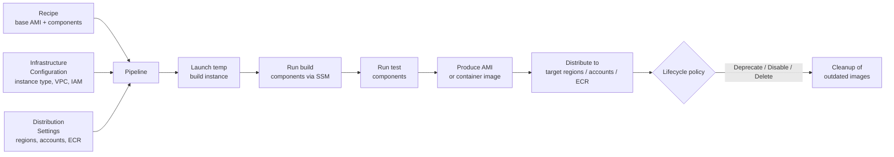

# EC2 Image Builder

> **Automate the creation, hardening, testing, patching, and distribution of golden AMIs and container images. Free service (pay only for underlying resources). Built-in pipeline, lifecycle policies, cross-Region / cross-account distribution.**

Maps to: **Domain 2.1 — Design deployment strategies**, **Domain 1.2 — Prescribe security controls** (image hardening / patch baselines)

---

## Overview

- Automates creation of **VM images (AMIs)** and **container images** for AWS workloads
- You own the customized images Image Builder creates in your account
- Configure pipelines to automate updates + system patching for the images you own
- Stand-alone command or pipeline execution
- Integrates with **AWS Organizations** to enforce SCP-style policies that restrict accounts to approved AMIs
- Integrates with **AWS RAM (Resource Access Manager)** to share components, recipes, and images across accounts
- Publishes container images to **Amazon ECR**
- Uses **AWS Systems Manager (SSM) Agent** on the build instance to execute components — requires `AmazonSSMManagedInstanceCore` policy
- Cross-account + cross-Region AMI distribution built-in
- Scheduled (weekly, on package updates) or on-demand triggers
- **Free** — you pay only for the temporary EC2 build instance, EBS volumes, and resulting AMI / image storage

---

## Pipeline Flow

---

## Key Concepts

- **Components** — YAML / JSON documents defining steps:
  - **Build components** — customize the instance (install packages, harden, configure)
  - **Test components** — validate the resulting image
  - At least 1 build component required; max 20 total (build + test combined)
- **Recipes** — base image + ordered list of components
  - **Image Recipe** — produces AMIs
  - **Container Recipe** — produces Docker images destined for ECR
- **Pipeline** — orchestrates the end-to-end build: launches a temp instance, applies components, runs tests, creates the output image, distributes it. Schedule or manual trigger
- **Infrastructure Configuration** — defines the build instance: type, VPC / subnet, security group, key pair, IAM instance profile
- **Distribution Settings** — where the output goes: target Regions for AMI copy, target accounts for sharing, ECR repos for container images
- **Lifecycle Policies** — automate deprecation / disabling / deletion of outdated images. **Wildcard patterns** manage images from multiple recipes in a single policy
- **Auto-versioning** — automatically increments component and recipe versions; simplifies IaC workflows

---

## IAM Requirements

The IAM role attached to the build instance profile must include:

- `EC2InstanceProfileForImageBuilder` — AMI builds
- `EC2InstanceProfileForImageBuilderECRContainerBuilds` — container image builds
- `AmazonSSMManagedInstanceCore` — SSM Agent operation
- `s3:PutObject` on the target bucket (`arn:aws:s3:::<BucketName>/*`) if you configure logging

The build instance must reach:
- **SSM endpoints** (`ssm`, `ssmmessages`, `ec2messages`) — either internet egress or VPC endpoints
- **S3** (for AWS CLI download during container builds) — internet or S3 VPC endpoint
- **Docker Hub** or your container registry (for container recipes only) — internet or proxy

---

## Patterns

- **Golden AMI pipeline (multi-account Organizations)**:
  1. Central security account owns the recipe + pipeline
  2. Distribution Settings share the AMI with member accounts (or with the entire Organization)
  3. RAM shares the components / recipes for downstream teams
  4. Lifecycle policy deprecates AMIs older than N days
- **Patch cycle**:
  1. Schedule the pipeline weekly
  2. Build component applies OS patches (`yum update`, `apt upgrade`, Windows Update)
  3. Test component runs Inspector / custom validation
  4. Successful AMI is distributed, prior AMIs deprecated
- **Container image factory**:
  1. Container recipe with hardening + scanning components
  2. Push to multi-Region ECR repos via Distribution Settings
  3. ECR enhanced scanning (powered by Inspector) provides CVE reports

---

## Exam Tips

- **Image Builder = automated golden AMI / container image pipeline** with patching, hardening, testing, distribution
- **Free service** — you pay only for the underlying resources (EC2, EBS, AMI storage)
- **Cross-Region AND cross-account distribution** is built-in — critical for multi-account Organizations golden-AMI patterns
- Build instance needs **SSM connectivity** (internet egress or VPC endpoints for `ssm` / `ssmmessages` / `ec2messages`)
- **Lifecycle policies** automate AMI cleanup — answer for "how do I manage AMI sprawl?"
- **Container image builds** push to **ECR** — alternative to AMI-only workflows
- **AWS RAM** integration shares recipes / components across accounts — useful in Organizations with a central security team
- Pairs well with **Inspector** (CVE scanning of resulting AMIs / container images) and **Systems Manager Patch Manager** baselines (define what to patch)

---

## Exam Traps

- **Image Builder ≠ EC2 Launch Templates** — Launch Templates define *how to launch* an instance; Image Builder defines *how to build* the AMI itself
- **Image Builder ≠ Systems Manager Patch Manager** — Patch Manager patches *running* instances; Image Builder bakes patches into a *new* AMI (immutable infrastructure)
- **Image Builder ≠ AWS Marketplace AMIs** — Marketplace = third-party AMIs; Image Builder = your own customized AMIs
- **Container image builds need internet** — if a question describes a private subnet with no NAT, container builds fail unless VPC endpoints for S3 + a Docker Hub mirror / proxy are configured
- **Image Builder does NOT deploy instances** — it only produces AMIs / container images. Deployment is handled by Auto Scaling, ECS, EKS, or other services
- **Don't confuse Image Builder distribution with cross-Region AMI `copy-image`** — Image Builder Distribution Settings automate this, but the underlying mechanism is still cross-Region copy with KMS re-encryption requirements
- **The 20-component limit is build + test combined**, not 20 of each
