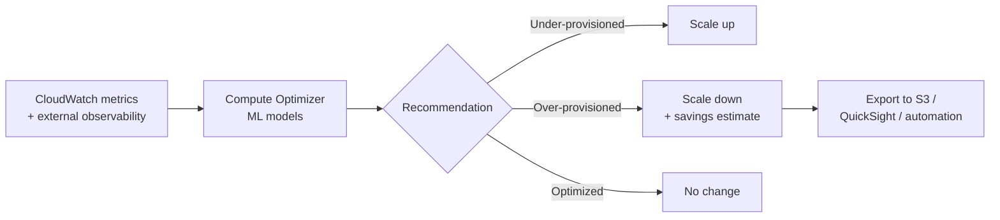

# AWS Compute Optimizer

> **ML-powered right-sizing recommendations across EC2, ASG, EBS, Lambda, Fargate ECS, RDS, and Aurora. Uses historical CloudWatch metrics to suggest specific instance types and sizes with savings estimates. No agent for most resources. Free (Enhanced Metrics is opt-in paid).**

Maps to: **Domain 3.5 — Improve cost**, **Domain 2.6 — Cost-optimized solutions**, **Domain 3.2 — Improve performance**

---

## Overview

- **ML-powered** right-sizing using historical CloudWatch metrics
- **No agent to install** for most resources — uses existing CloudWatch metrics
- **Free** (Enhanced Infrastructure Metrics is paid, opt-in)
- Multi-account integration with **AWS Organizations** — enable from management or delegated admin account for org-wide visibility
- Exports recommendations to **S3 (CSV / JSON)** for downstream reporting (QuickSight, Athena) or automation

---

## Supported Resources

- **EC2 instances** (standalone)
- **EC2 Auto Scaling groups** — fixed-config only (same instance type, no Mixed Instances Policy, target-tracking only)
- **EBS volumes**
- **Lambda functions** (memory sizing recommendations)
- **ECS services on Fargate**
- **RDS MySQL / PostgreSQL DB instances** (instance class + storage)
- **Aurora MySQL / PostgreSQL** (provisioned)
- **Commercial software licenses** on EC2 (e.g., SQL Server) — license utilization-based right-sizing

---

## Recommendation Findings

| Finding | Meaning | Action |
|---|---|---|
| **Under-provisioned** | Risk of performance issues | Scale up |
| **Over-provisioned** | Wasting money | Scale down (savings opportunity) |
| **Optimized** | Correctly sized | None |
| **None** | Not enough data (< 30h of metrics) | Wait for more telemetry |

---

## Configuration

- **Default lookback**: 14 days of CloudWatch metrics
- **Enhanced Infrastructure Metrics** (paid, opt-in) — extends lookback to **3 months** for seasonal / steady workloads
- **Memory metrics on EC2** are NOT captured by default — install the **CloudWatch agent** for memory-based recommendations; otherwise CPU / network / disk only
- **External Metrics Ingestion** — bring observability data from **Datadog, Dynatrace, New Relic, AppDynamics, Instana** for richer recommendations

---

## How It Works

---

## Differences from Related Services

| Service | Role |
|---|---|
| **Compute Optimizer** | ML-driven, specific right-sizing recommendations (exact instance type/size, Lambda memory) |
| **Trusted Advisor** | Rule-based checks across 5 pillars (cost, perf, security, fault tolerance, limits); flags idle / low-util resources but no ML right-sizing |
| **Cost Explorer** | Visualize / forecast spend; recommends Savings Plans — NOT right-sizing |
| **Cost Optimization Hub** | Aggregates recommendations from Compute Optimizer + Trusted Advisor + Cost Explorer + RDS into a single dashboard |

---

## Exam Tips

- **Compute Optimizer = ML right-sizing across EC2, ASG, EBS, Lambda, Fargate ECS, RDS, Aurora** — specific instance type / size / memory recommendation with savings estimate
- **Multi-account / Organizations** — enable from management or delegated admin for org-wide right-sizing visibility
- **Enhanced Infrastructure Metrics** (paid) — extend lookback to 3 months for seasonal / steady workloads where 14 days isn't enough
- **CloudWatch agent required** for EC2 memory-based recommendations
- **External Metrics Ingestion** — bring Datadog / Dynatrace / New Relic data for richer recommendations
- **Export to S3** for downstream automation (QuickSight reports, Athena queries, EventBridge → Lambda for auto-resize)
- **Cost Optimization Hub** is the consolidated dashboard combining Compute Optimizer + Trusted Advisor + Cost Explorer recommendations
- "Need a specific instance type recommendation, not just 'reduce cost'" → **Compute Optimizer**

---

## Exam Traps

- **Compute Optimizer ≠ Trusted Advisor** — Compute Optimizer is ML-driven right-sizing; Trusted Advisor is rule-based best-practice checks
- **Compute Optimizer ≠ Cost Explorer** — Cost Explorer visualizes spend and recommends Savings Plans; Compute Optimizer recommends resource configuration changes
- **Mixed Instances Policy ASGs are NOT supported** — only fixed-config ASGs with target tracking
- **Lambda recommendations are memory-only** — function timeout and architecture (x86 / arm64) are NOT recommended by Compute Optimizer
- **Recommendations require ≥ 30 hours of metrics** — newly launched resources won't have recommendations immediately
- **EC2 memory metrics need the CloudWatch agent** — without it, you get CPU / network / disk-only recommendations
- **Recommendations are advisory, not auto-applied** — Compute Optimizer does NOT change resources for you; automation is on you (Step Functions, Lambda, Systems Manager Automation)
