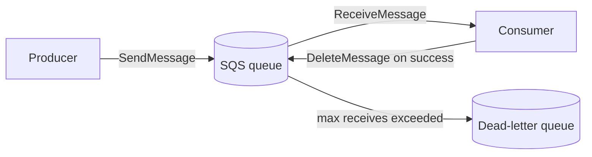

# Amazon SQS (Simple Queue Service)

> **Fully managed, distributed message queuing. Decouple producers from consumers. Standard queues (nearly unlimited TPS, at-least-once, best-effort ordering) and FIFO queues (exactly-once, strict order, up to 70,000 TPS with high-throughput mode). Pull-based — consumers poll. Messages up to 256 KB (2 GB with Extended Client + S3). Retention 1 min – 14 days, default 4 days.**

Maps to: **Domain 2.4 — Decoupling / event-driven**, **Domain 4.3 — Modernization**

---

## Overview

- AWS's oldest service
- **Fully managed, distributed message queuing**
- **Pull-based** — consumers poll for messages
- Decouples producers from consumers; consumer can be down/slow without losing messages
- Messages **1 byte to 256 KB**; up to **2 GB with SQS Extended Client Library** (stores payload in S3, reference in queue)
- **Retention**: 60 s – 14 days (default 4 days); expired messages auto-deleted
- **Encryption** at rest with KMS (SSE-KMS or SSE-SQS) + in transit with TLS

---

## Queue Types

| Feature | **Standard** | **FIFO** |
|---|---|---|
| Throughput | Nearly unlimited TPS | 300 TPS default; **70,000 TPS with high-throughput mode** (per-message-group-ID parallelism) |
| Order | Best-effort | Strict FIFO per message group |
| Delivery | **At-least-once** (occasional duplicates) | **Exactly-once** processing |
| Duplicate protection | App-side | 5-minute deduplication window |
| Naming suffix | none | must end in `.fifo` |

- **FIFO**: banking transactions, ordered command processing, anywhere duplicates would be catastrophic
- **Standard**: any idempotent processing (most workloads)

---

## Producer → Queue → Consumer

- Consumer must call **`DeleteMessage`** after processing — otherwise message reappears after visibility timeout
- **Visibility timeout** = message hidden from other consumers while one is processing
  - Default **30 s**, range **0 s – 12 hours**
  - Extend mid-processing with `ChangeMessageVisibility`
  - Set to `0` to immediately make a message available again

---

## Polling Modes

| Mode | Behavior | When |
|---|---|---|
| **Short polling** (default) | `ReceiveMessage` queries a subset of servers; returns immediately even if no messages | Latency-sensitive, low volume |
| **Long polling** | `ReceiveMessage` waits up to `WaitTimeSeconds` (max 20 s) for ≥1 message | **Recommended** — reduces empty responses + cost |

Long polling cuts API calls and is the default best practice.

---

## Delay Queues

- Postpone delivery of **new** messages by up to **15 minutes** (`DelaySeconds`)
- Default 0 s
- **Standard**: per-queue delay change does NOT affect already-enqueued messages
- **FIFO**: per-queue delay change DOES affect already-enqueued messages
- Per-message `MessageTimer` overrides queue-level setting (Standard only)

**Delay queue vs Visibility timeout**: Delay hides at **enqueue**; Visibility timeout hides **after consumption**.

---

## Dead-Letter Queue (DLQ)

- Captures messages that fail processing after `maxReceiveCount` attempts
- Same queue type as source (Standard ↔ Standard, FIFO ↔ FIFO)
- **DLQ Redrive** — Console + API to replay messages back to source after fix
- Monitor DLQ depth with CloudWatch alarms

---

## Lambda Integration (Event Source Mapping)

- Lambda **polls** SQS and invokes with batches
- **Standard**: scales to **1,000 concurrent batches**; max batch 10,000 messages
- **FIFO**: scales to **5 concurrent batches per message group ID**
- **Maximum Concurrency** — cap Lambda concurrency per ESM so SQS bursts don't overwhelm downstream
- **Provisioned Mode for SQS ESM** — min/max event pollers for sudden spikes
- **Partial batch responses** — return failed item IDs so only failures retry
- **Message filtering** at ESM level — skip non-matching messages without invoking Lambda

---

## Key Metrics

- **`ApproximateNumberOfMessagesVisible`** — queue depth
- **`ApproximateAgeOfOldestMessage`** — backlog SLA monitoring; pair with ASG target tracking
- **`NumberOfMessagesSent` / `Received` / `Deleted`** — throughput

---

## Security

- **At rest**: **SSE-SQS** (AWS-managed) or **SSE-KMS** (CMK)
- **In transit**: TLS
- **Resource-based queue policies** — cross-account without IAM role assumption
- **VPC endpoints (Interface)** — keep traffic private
- **Server-side data key reuse** — reduce KMS calls (5 min cache default)

---

## SQS vs Alternatives

| Need | Service |
|---|---|
| Decoupling worker queue | **SQS Standard** |
| Strict order + exactly-once | **SQS FIFO** |
| Fan-out (1-to-many) | **SNS** (often with SQS subscribers) |
| Event routing + content filtering | **EventBridge** |
| Streaming + replay + multiple consumers | **Kinesis Data Streams** |
| Managed Kafka / RabbitMQ for lift-and-shift | **MSK** / **Amazon MQ** |
| Sync request-response | API Gateway + Lambda |

---

## Exam Tips

- **At-least-once for Standard, exactly-once for FIFO** — design idempotent consumers for Standard
- **Default visibility timeout 30 s, max 12 hours**
- **Default retention 4 days, max 14 days**
- **Long polling > short polling** for nearly every workload
- **DLQ + maxReceiveCount** is the standard error-handling pattern
- **DLQ Redrive** to replay messages after a fix
- **Extended Client Library** for messages > 256 KB (S3 payload)
- **Lambda + SQS Standard** scales to 1,000 concurrent batches; **Maximum Concurrency** caps that
- **FIFO high-throughput mode** uses message group ID parallelism — design groups for scale
- **`ApproximateAgeOfOldestMessage`** for SLA-driven ASG scaling
- **Cross-account**: queue policies > role assumption
- **VPC endpoints** keep SQS traffic private

---

## Exam Traps

- **SQS is pull-based, not push** — for push semantics use **SNS** or **EventBridge**
- **FIFO is 300 TPS without high-throughput mode** — and HT mode requires distinct message group IDs to actually parallelize
- **Visibility timeout failure causes duplicate processing** — design idempotent consumers
- **DLQ is a separate queue you must create** — `maxReceiveCount` lives on the source queue redrive policy, not the DLQ
- **DLQ for FIFO source must also be FIFO** — type mismatch is rejected
- **256 KB is a hard limit** — Extended Client Library is the only way past it
- **SQS Standard does NOT guarantee order** — even consecutive messages may arrive out-of-order
- **Cross-Region replication is NOT native** — implement at the app level
- **Lambda + SQS FIFO concurrency** is capped per message group ID, not per queue
- **Delay queues max 15 minutes** — longer delays need **Step Functions Wait** or **EventBridge Scheduler**
