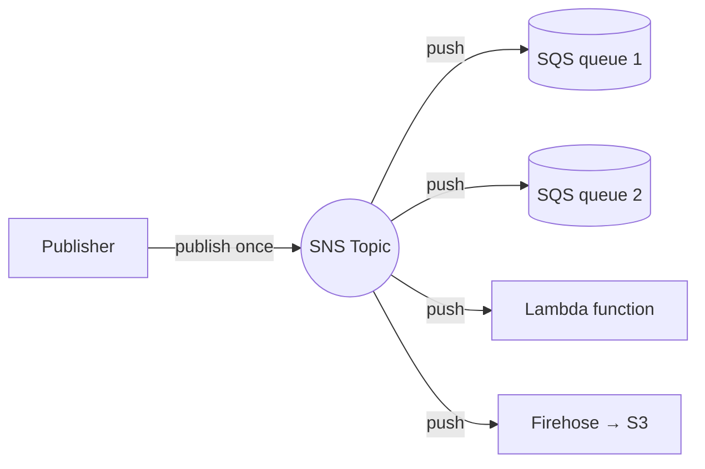

# Amazon SNS (Simple Notification Service)

> **Fully managed pub/sub messaging. Publishers push to a Topic; SNS pushes to all subscribers. Decouple producers from many consumers (fan-out). Two topic types: Standard (high throughput, at-least-once, best-effort ordering) and FIFO (strict order, exactly-once). Subscribers: SQS, Lambda, HTTPS, Email, SMS, Mobile Push, Firehose. Subscription filter policies + Message Data Protection for PII.**

Maps to: **Domain 2.4 — Decoupling / event-driven**, **Domain 4.3 — Modernization**

---

## Overview

- Fully managed **pub/sub** messaging service
- **Push-based** — subscribers do NOT poll; SNS pushes to each subscriber
- Topic = logical access point; one message → many subscribers (**fan-out**)
- Multi-AZ redundant storage
- Up to **12.5M subscriptions per topic**, **100,000 topics per account** (default, raisable)

---

## Topic Types

| Feature | **Standard** | **FIFO** |
|---|---|---|
| Throughput | Unlimited | 300 TPS (default) / 3,000 TPS (high-throughput mode) |
| Order | Best-effort | Strict per message group |
| Delivery | At-least-once | Exactly-once |
| Dedup | App-side | 5-min dedup window |
| Subscribers supported | SQS, Lambda, HTTPS, Email, SMS, Mobile Push, Firehose | **SQS FIFO only** |
| Naming suffix | none | `.fifo` |

---

## Subscription Protocols

- **Amazon SQS** — most common; queue for async workers (often Standard SNS → multiple SQS for fan-out)
- **AWS Lambda** — invoke functions on publish
- **HTTPS / HTTP** — webhook
- **Email / Email-JSON** — plain text or structured JSON
- **SMS** — text message
- **Mobile Push** — APNS (Apple), FCM (Google), ADM (Amazon), Baidu, Windows Mobile
- **Kinesis Data Firehose** — deliver to S3 / Redshift / OpenSearch / Splunk / third-party without Lambda glue
- **Application** (platform endpoints) — mobile devices

---

## Message Filtering

- **Subscription filter policies** — JSON evaluated against message attributes or **message body**
- Each subscriber receives only matching messages
- Use case: one topic "order events" → different subscribers for `order.created` / `order.refunded` / `order.cancelled`

---

## Cross-Region & Cross-Account

- **Cross-account**: topic policies grant publish / subscribe
- **Cross-Region**: subscribe targets in other Regions (HTTPS, Email, SMS; for SQS / Lambda use cross-Region ARN)

---

## SNS + SQS Fan-Out Pattern

Single publish hits multiple consumers, each at its own pace. Each SQS subscriber controls visibility/retention independently.

---

## Message Data Protection (PII)

- **Inspect + mask** sensitive data (credit card, SSN, etc.) in messages
- Topic-level **data protection policies**
- Modes: **Audit** or **Deny / Mask**
- Use cases: GDPR / HIPAA compliance, PII scrubbing before delivery

---

## Dead-Letter Queues

- **Subscription-level** DLQs (not topic-level)
- SQS DLQ per subscription for failed deliveries (4xx, 5xx, timeouts)

---

## Retry Policy

- **AWS-managed targets** (SQS, Lambda, Firehose): handled automatically
- **HTTPS / HTTP**: customizable retry policy (default 3 retries, linear backoff)
- Failed deliveries → DLQ if configured

---

## Security

- **At rest**: KMS (SSE-KMS); AWS-managed key default
- **In transit**: TLS
- **Topic policies** (resource-based) — cross-account
- **VPC endpoints (Interface)** — private publish
- **IAM** for control-plane + publish

---

## AWS Service Publishers

CloudWatch Alarms, Budgets, AWS Health, S3 events, Auto Scaling lifecycle, RDS events, EventBridge, AWS Config rules, GuardDuty findings, Security Hub.

---

## Message Attributes

- Up to **10 attributes per message** (string, number, binary)
- Power subscription filter policies

---

## Mobile Push

- APNS / FCM / ADM / Baidu / Windows Mobile
- **Platform Application** + **Endpoint** per device token
- Cross-platform from a single topic

---

## SNS vs Alternatives

| Need | Service |
|---|---|
| Fan-out single event to multiple subscribers | **SNS** |
| Worker queue with retries | **SQS** |
| Event routing with rich content rules + many target types | **EventBridge** |
| Streaming with replay + multiple consumers | **Kinesis Data Streams** |
| Lift-and-shift RabbitMQ / ActiveMQ | **Amazon MQ** |

> Canonical async multi-consumer pattern: **SNS + SQS fan-out**.

---

## Exam Tips

- **Push-based fan-out** — SNS pushes, SQS pulls
- **FIFO topics deliver to SQS FIFO only** — Lambda / HTTPS / Email NOT supported on FIFO
- **Subscription filter policies** route messages without extra logic
- **Filter on message body** (not just attributes)
- **Subscription DLQs** — per subscription, not per topic
- **Message Data Protection** for PII masking (compliance)
- **SNS + Kinesis Firehose** writes to S3 / Redshift / OpenSearch without Lambda glue
- **Cross-account topic policies** > role assumption
- **VPC endpoints** for private SNS publish
- **Mobile push** = Platform Applications + Endpoints

---

## Exam Traps

- **SNS is push, not pull** — confusing with SQS is a common distractor
- **FIFO topic → ONLY SQS FIFO subscribers** — Lambda / HTTPS / Email won't work
- **DLQs are subscription-level, NOT topic-level**
- **Cross-Region delivery to AWS-managed targets** (SQS / Lambda) possible but uncommon
- **Email subscriptions require manual confirmation** by clicking the link
- **Default topic encryption uses SSE managed key** — for compliance use a customer-managed KMS key
- **Filter policies are per-subscription**
- **Mobile push platform endpoints expire** — refresh device tokens
- **SNS retries on HTTPS are NOT infinite** — configure DLQ to avoid dropped events
- **CloudTrail control-plane events visible by default**; data-plane (Publish) require enabling
