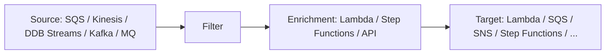

# Amazon EventBridge

> **Serverless event bus for routing events from AWS services, your apps, and SaaS partners to AWS targets. Rules with content-based filters. Pipes for point-to-point integration without Lambda glue. Scheduler for cron / one-time tasks at scale. Schema Registry for type-safe event consumers. Archive + Replay for forensics and re-processing. Three bus types: default, custom, partner.**

Maps to: **Domain 2.4 — Decoupling / event-driven**, **Domain 4.3 — Modernization**

---

## Overview

- Serverless event bus — no infrastructure
- Routes events from **AWS services**, **your apps**, **SaaS partners** to **AWS targets**
- **Rules with content-based filtering** (JSON pattern matching on event content)
- **Targets**: Lambda, Step Functions, SNS, SQS, Kinesis, ECS Task, CodeBuild, API Gateway, SSM Automation, EC2 actions, Firehose, Glue, SageMaker, IoT, API Destinations (HTTPS), 30+ more
- **EventBridge is the modernization of CloudWatch Events** — same API + much more

---

## Bus Types

| Bus | Purpose |
|---|---|
| **Default bus** | Receives events from AWS services in this account |
| **Custom bus** | Your apps publish business events here |
| **Partner bus** | SaaS providers push events (Auth0, Datadog, Salesforce, Shopify, Stripe, Zendesk, etc.) |

> Multiple custom buses can logically segregate domains.

---

## Rules & Filtering

- **Event pattern**: JSON content filter (source, detail-type, fields in `detail`)
- **Schedule pattern**: cron / rate expressions — **legacy; use EventBridge Scheduler for new designs**
- **Targets per rule**: up to 5
- **Input Transformer** — reshape event payload before target delivery
- **Dead-Letter Queue per target** (SQS) — capture failures
- **Retry policy per target** — max retries + max event age

---

## EventBridge Pipes

- **Point-to-point integration** without Lambda glue
- Stages: **Source → Filter → Enrichment → Target**
- **Sources**: SQS, Kinesis, DynamoDB Streams, Kafka (MSK / self-managed), Amazon MQ
- **Filters**: same JSON content filtering as rules
- **Enrichment** (optional): Lambda, Step Functions, API Gateway, API Destinations
- **Targets**: same target list as rules

Use case: "Forward filtered SQS messages, enrich with metadata, push to Step Functions" — no custom code.

---

## EventBridge Scheduler

- **Separate from EventBridge rules** — dedicated scheduler service
- Supports **millions of schedules**, **one-time** + **recurring**
- **At-Once delivery model**
- Time zones, DST, end dates
- Targets: any EventBridge target
- Per-schedule retry + DLQ
- **Use case**: bulk per-tenant cron in SaaS apps (legacy cron rules cap at 300 per bus; Scheduler scales much higher)

---

## Schema Registry

- **Auto-inferred** schemas from observed events on the bus
- **Schema versioning**
- **Code bindings** generated for Java, Python, TypeScript — type-safe consumer code
- Searchable schema catalogue

---

## Archive + Replay

- **Archive** all (or filtered) events on a bus
- KMS-encrypted at rest
- Retention 0 (indefinite) to chosen days
- **Replay** archived events — forensics, re-processing after bug fix, testing

---

## API Destinations

- **EventBridge target = any HTTPS endpoint**
- **Connection objects** store credentials (Basic, OAuth 2.0, API Key)
- Built-in **rate limiting** + retry policy
- Use case: deliver to Salesforce, Slack, on-prem APIs without writing Lambda

---

## Cross-Account & Cross-Region

- **Cross-account**: bus resource policy + IAM role on rule target
- **Cross-Region replication** — multi-Region event pipelines / DR

---

## Security

- **At rest**: KMS for archived events
- **In transit**: TLS
- **Bus-level resource policies** for cross-account access
- **CloudTrail** logs control-plane API calls
- **IAM** scoped per bus / rule

---

## Pricing

- **$1.00 per 1M custom events** to your buses
- AWS-service events are **free** to the default bus
- **Pipes**: $0.40 per 1M events
- **Scheduler**: $1.00 per 1M invocations (after free tier 14M / month)
- **Archive**: storage + replay cost

---

## EventBridge vs Alternatives

| Need | Service |
|---|---|
| Event routing with content filtering + many AWS targets | **EventBridge Rules** |
| Point-to-point Kafka / SQS / DDB Streams → AWS target without Lambda | **EventBridge Pipes** |
| Cron at huge scale (millions of schedules) | **EventBridge Scheduler** |
| Fan-out to many subscribers (push) | **SNS** |
| Queue-based async worker | **SQS** |
| Streaming with replay + ordered consumption | **Kinesis Data Streams** |

---

## Exam Tips

- **EventBridge = upgraded CloudWatch Events**
- **Event pattern** = JSON content filter on event fields
- **Up to 5 targets per rule**
- **Input Transformer** reshapes payloads
- **DLQ per target** + retry policy
- **EventBridge Pipes** = no-code point-to-point for SQS / Kinesis / DDB Streams / Kafka / MQ → AWS target
- **EventBridge Scheduler** for cron at scale (separate from rules)
- **Schema Registry + code bindings** for type-safe consumers
- **Archive + Replay** for forensics / re-processing
- **API Destinations** deliver to any HTTPS endpoint with auth + rate limiting
- **Cross-Region replication** for multi-Region event pipelines
- **SaaS partner events** flow into partner event buses (Auth0, Datadog, Salesforce, Stripe, Zendesk, etc.)

---

## Exam Traps

- **EventBridge Pipes ≠ EventBridge Rules** — Pipes is point-to-point (1 source → 1 target); Rules can fan-out to multiple targets
- **EventBridge Scheduler is separate from rule schedules** — schedules in rules are legacy
- **AWS-service events go to the default bus**, NOT custom buses
- **Custom events to default bus are free**, but cross-account rules need custom buses with resource policies
- **Cross-account rules** require target IAM role with `events:PutEvents` AND a bus policy on the receiving bus
- **EventBridge rules don't guarantee order** — use FIFO SQS / Kinesis for ordering
- **Schema Registry inference takes time** — schemas don't appear instantly
- **Archive replay reuses the same event ID** — design idempotent consumers
- **API Destinations have HTTP timeout limits** — for long downstream calls use Lambda as the target instead
