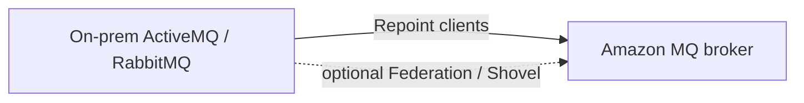

# Amazon MQ

> **Managed Apache ActiveMQ + RabbitMQ message brokers. The lift-and-shift answer for migrating on-prem messaging to AWS without rewriting application code. Speaks industry-standard protocols (JMS, AMQP 0.9.1, AMQP 1.0, STOMP, MQTT, OpenWire, WSS). VPC-only. Three topologies: single-instance (dev), Active/Standby (HA), Cluster mesh (RabbitMQ).**

Maps to: **Domain 2.4 — Decoupling**, **Domain 4.2 / 4.3 — Migration & modernization**

---

## Overview

- Managed **Apache ActiveMQ** and **RabbitMQ** brokers
- **The lift-and-shift answer** for migrating on-prem JMS / AMQP messaging to AWS without rewriting code
- Supports **industry-standard protocols** — existing apps work unchanged
- **Always VPC-deployed**
- **Multi-AZ HA** options built in

---

## When to Use MQ vs SQS / SNS

| Use case | Service |
|---|---|
| Migrating existing JMS / AMQP / STOMP / MQTT apps to AWS | **Amazon MQ** |
| Brand-new cloud-native pub/sub or queue | **SNS / SQS** |
| Lift-and-shift on-prem RabbitMQ | **Amazon MQ for RabbitMQ** |
| Lift-and-shift on-prem ActiveMQ | **Amazon MQ for ActiveMQ** |
| Massive scale, AWS-native messaging | **SNS + SQS fan-out** |

> "Industry-standard protocols + lift-and-shift" → Amazon MQ. "AWS-native, infinite scale" → SNS / SQS.

---

## Broker Engines

### Amazon MQ for ActiveMQ

- **JMS** (Java Message Service)
- **AMQP 1.0**
- **STOMP**
- **MQTT** (IoT)
- **WebSocket Secure (WSS)** for browser clients
- **OpenWire** (native ActiveMQ)

### Amazon MQ for RabbitMQ

- **AMQP 0.9.1**
- **Web STOMP, Web MQTT** via plugins
- **Management API**

---

## Deployment Topologies

### Single-Instance

- One broker in one AZ
- **No HA** — dev / test only

### Active/Standby (ActiveMQ + RabbitMQ)

- **Two brokers across 2 AZs**
- Automatic failover within seconds
- Same DNS endpoint — app code unchanged
- **ActiveMQ**: shared EFS-backed storage; one active at a time
- **RabbitMQ**: standby maintains quorum

### Cluster Mesh (RabbitMQ only)

- **3 nodes across 3 AZs**
- Active-active — all nodes accept connections
- Quorum-based queue replication

---

## Network & Security

- **VPC-only**; can enable public endpoint with caution
- **Security groups** restrict access
- **AWS PrivateLink** for cross-VPC / cross-account access
- **At rest**: KMS (AWS-owned or customer-managed key)
- **In transit**: TLS (mandatory for public-facing brokers)
- **Authentication**:
  - **Internal user database** (both engines)
  - **LDAP** (ActiveMQ only)
  - **Active Directory** via LDAP
- **CloudWatch metrics + logs**
- **CloudTrail** for control-plane

---

## Maintenance Windows

- AWS patches brokers during weekly **maintenance window** (default Sun 03:00 UTC)
- **No automatic minor version upgrades** — must enable explicitly
- HA topologies fail over during maintenance

---

## Pricing

- Pay per **broker instance hour** + storage + data transfer
- More expensive than SQS / SNS (per-request) — reflects dedicated brokers
- Sizes: `mq.t3.micro` → `mq.m5.4xlarge`

---

## Migration Patterns

- **Apps don't change** — same protocol, same clients
- **ActiveMQ**: use **Network of Brokers** to bridge on-prem ↔ AWS during cutover
- **RabbitMQ**: use **Federation** or **Shovel** plugin

---

## Cross-Region / DR

- Brokers are **regional**
- DR options:
  - Cross-Region broker + app-level message replication
  - RabbitMQ **Shovel** to a secondary Region broker
- Active/Standby protects against AZ failure, NOT Region failure

---

## Exam Tips

- "Migrate existing on-prem JMS / AMQP / RabbitMQ messaging to AWS" → **Amazon MQ**
- "Greenfield cloud-native fan-out pub/sub" → **SNS / SQS**
- **VPC-only deployment**
- **Active/Standby** for multi-AZ HA (same DNS endpoint, automatic failover)
- **RabbitMQ Cluster Mesh** = 3 nodes / 3 AZs, active-active
- **PrivateLink** for cross-VPC / cross-account
- **ActiveMQ protocols**: JMS, AMQP 1.0, STOMP, MQTT, WSS, OpenWire
- **RabbitMQ protocols**: AMQP 0.9.1, Web STOMP, Web MQTT, Management API
- **Authentication**: internal user DB OR LDAP (ActiveMQ only)
- **More expensive than SQS / SNS** — favor SQS / SNS unless protocol compatibility required

---

## Exam Traps

- **Amazon MQ ≠ MSK** — MQ is ActiveMQ / RabbitMQ; **MSK is Apache Kafka**
- **AMQP 0.9.1 (RabbitMQ) ≠ AMQP 1.0 (ActiveMQ)** — incompatible protocols despite shared name
- **Brokers are VPC-only** — public endpoints exist but discouraged
- **Active/Standby is single-Region** — does NOT protect against Region failure
- **No native cross-Region replication** — implement at the app / broker plugin level
- **No auto minor version upgrades** unless enabled
- **MQ is NOT serverless** — pay broker instance hours regardless of use
- **MQ does NOT replace SNS / SQS for AWS-native event-driven** — pick MQ ONLY for protocol compatibility
- **MQ for RabbitMQ does NOT support all RabbitMQ plugins** — only a curated set (check docs)
