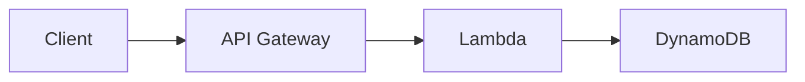

# Amazon API Gateway

> **Managed API front door. Three flavors: REST API (full features), HTTP API (cheaper, faster, fewer features), WebSocket API (stateful real-time). Integrations: Lambda, HTTP backends, AWS service actions, mock. Auth: IAM, Lambda authorizers, Cognito, JWT (HTTP API). Edge-optimized / Regional / Private endpoints. Throttling, caching, usage plans + API keys, WAF integration, custom domains via ACM.**

Maps to: **Domain 2.5 — Architectures**, **Domain 1.2 — Security**, **Domain 4.3 — Modernization**

---

## Overview

- Managed API service for **HTTP / REST / WebSocket APIs**
- **HTTPS only**
- Throttles at **10,000 RPS default** (raisable), **5,000 concurrent per account**
- **29-second integration timeout**, **10 MB max payload**
- Integrates with **Lambda, HTTP backends, any AWS service action, VPC Link, ALB, NLB**
- WAF, Shield, X-Ray, CloudWatch, CloudTrail

---

## API Types

| Type | Use case | Cost | Features |
|---|---|---|---|
| **REST API** | Full feature set: usage plans, API keys, request validation, mapping templates, caching | $$$ | All features |
| **HTTP API** | Simpler proxy to Lambda / ALB / NLB | ~70% cheaper | JWT auth, CORS, lower latency; no usage plans, no caching, no Edge-optimized |
| **WebSocket API** | Stateful real-time (chat, gaming, dashboards) | $$ | Bidirectional `@connections` API |

> Default for new HTTP APIs: **HTTP API** unless you need REST-only features.

---

## Endpoint Types

| Type | Description |
|---|---|
| **Edge-Optimized** (default REST) | Via CloudFront edge; lower latency global |
| **Regional** | Same Region; combine with own CloudFront for custom caching |
| **Private** | VPC-only via Interface VPC Endpoint; resource policy enforces |

---

## Integration Types

- **Lambda Proxy (AWS_PROXY)** — preferred for Lambda
- **Lambda Custom (AWS)** — VTL-mapped
- **HTTP Proxy (HTTP_PROXY)** — pass-through
- **HTTP Custom (HTTP)** — VTL-mapped
- **AWS Service** — direct call (Step Functions, SQS, etc.)
- **VPC Link** — REST → NLB; HTTP API → ALB / NLB / Cloud Map
- **Mock** — canned response (testing + CORS preflight)

---

## Method / Integration Lifecycle

- **Method Request** — frontend
- **Integration Request** — backend setup
- **Integration Response** — backend response
- **Method Response** — frontend response
- **Mapping templates** (VTL) for request/response transformation

---

## Stages, Deployments, Stage Variables

- Deployments → **stages** (dev, staging, prod)
- **Up to 10 stages per API**
- **Stage variables** for per-stage config
- **Deployment history** for rollback
- **Canary deployments** — split percentage; promote when ready

---

## Caching

- **Cache key + TTL** per stage; per-method override
- **Default TTL 300s, max 3,600s**; TTL=0 disables
- **Capacity 0.5 GB – 237 GB**
- **Paid per-stage**
- **Client invalidate** with `Cache-Control: max-age=0` (with IAM auth)
- **Cache encryption** option

---

## Throttling

- **Account**: 10,000 RPS steady, 5,000 concurrent (default; raisable)
- **API**: per stage or method
- **Usage Plan**: per-API-key throttling + quotas
- **429 Too Many Requests** on exceed

---

## Usage Plans + API Keys (REST API only)

- API keys distributed to customers
- Usage plan: **rate + burst + quota**
- SaaS billing tiers (Bronze 1k/day, Silver 10k/day, Gold unlimited)

---

## Authentication & Authorization

| Method | Description |
|---|---|
| **IAM** | SigV4 signed requests |
| **Cognito User Pools** | JWT issued by Cognito |
| **Lambda Authorizer** (REST custom) | Lambda returns IAM policy + context |
| **JWT authorizer** (HTTP API) | Validate JWT from any OIDC provider — no Lambda |
| **mTLS** (REST + custom domain) | Client cert validation |
| **API Key + Usage Plan** | NOT for auth alone |

---

## Security Layers

- **WAF** integration (REST + HTTP)
- **Shield Standard** auto; **Shield Advanced** paid
- **Resource policies** — VPC / VPC endpoint / IP / account restrictions
- **TLS** always
- **Cache encryption** opt-in
- **CloudWatch Logs + CloudTrail + X-Ray**

---

## Custom Domain Names

- Map your domain (`api.example.com`) to API GW
- **ACM cert**:
  - **Edge-optimized** → cert in **`us-east-1`**
  - **Regional** → cert in same Region
- **CNAME or A-alias** in Route 53
- **Per-API mapping** for multiple APIs under one domain

---

## WebSocket API

- Stateful, bidirectional, persistent
- Use cases: chat, multiplayer gaming, collaboration, real-time dashboards, financial tickers
- **Routes**: `$connect`, `$disconnect`, `$default`, custom
- Backend: Lambda, DynamoDB, HTTP
- **`@connections` API** for server-initiated push
- **Max message 128 KB**; idle timeout 10 min

---

## Logging & Monitoring

- **CloudWatch Logs** — access + execution
- **CloudWatch metrics** — request count, latency, 4xx/5xx, cache hit/miss
- **X-Ray** distributed tracing
- **CloudTrail** for control-plane

---

## SDK + Documentation

- **Generate SDKs** for iOS, Android, JS, Java
- **OpenAPI / Swagger** import / export
- **API documentation** parts
- **Developer Portal** (open-source) for self-service API key registration

---

## Common Patterns

### API Gateway + Lambda

### API Gateway → S3

- Direct AWS service integration to S3 PUT
- Resumable / signed uploads without exposing S3

### Private API

- Endpoint type: Private
- Interface VPC Endpoint in your VPC
- Resource policy with `aws:SourceVpc` / `aws:SourceVpce`

### Canary release

- Stage canary settings: 0–100% traffic split
- Promote canary → base

---

## Exam Tips

- **REST API** = full features (usage plans, API keys, caching, mapping templates)
- **HTTP API** = cheaper, faster, simpler; **JWT auth without Lambda**
- **WebSocket API** for stateful real-time
- **3 endpoint types**: Edge-optimized (default REST), Regional, Private
- **Custom domain + ACM**: Edge-optimized cert in **`us-east-1`**; Regional in same Region
- **VPC Link**: REST → NLB; HTTP API → ALB / NLB / Cloud Map
- **AuthN**: IAM, Cognito, Lambda authorizer, JWT (HTTP API), mTLS (REST + custom domain)
- **Usage Plans + API Keys** for SaaS tiered billing
- **Throttling**: 10,000 RPS default; 429 on exceed
- **29-second integration timeout**, **10 MB payload**, **128 KB max WebSocket message**
- **Caching**: TTL 0–3600s, default 300s; paid per-stage
- **Canary deployment**: percentage split
- **Resource policies** for VPC / IP / account
- **WAF integration**: REST + HTTP (not WebSocket)

---

## Exam Traps

- **API GW is HTTPS only**
- **29-second integration timeout** — hard limit (REST private API raised to 300s; default still 29s)
- **REST API caching is paid** — don't enable by default
- **HTTP API does NOT support Edge-optimized** — Regional only
- **HTTP API does NOT support usage plans / API keys / request validation** — REST only
- **Custom domain cert Region**: Edge-optimized → `us-east-1`; Regional → same Region
- **API GW caches GET by default** — POST/PUT/DELETE require explicit config
- **Private API + VPC endpoint** requires resource policy + VPC endpoint policy
- **CORS** is client-enforced — API GW just sends headers
- **WebSocket idle timeout** is 10 min; max message 128 KB
- **WAF is NOT supported with WebSocket APIs**
