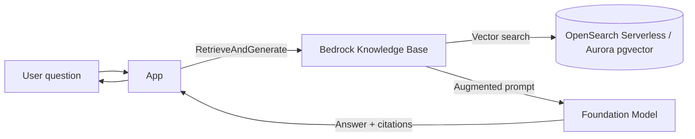
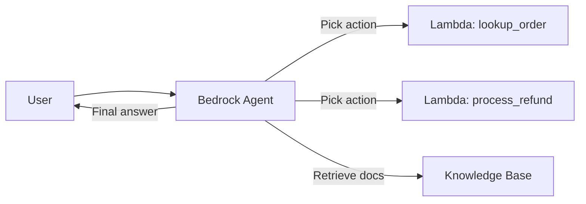

# Amazon Bedrock

> **Fully managed serverless GenAI platform: choice of foundation models (Anthropic Claude, Meta Llama, Mistral, Amazon Nova / Titan, Cohere, AI21, Stability AI) via a single API. Includes Knowledge Bases (managed RAG), Agents (tool-using workflows), Guardrails (content + PII filtering), Model Customization (fine-tune / continued pre-train), Bedrock Studio, and Prompt Management. Data stays in your account, never used to train base models. Default SAP-C02 answer for "build a GenAI feature on AWS without managing GPUs".**

Maps to: **Domain 4.3 — Modernization / GenAI integration**, **Domain 2.2 — Design for new solutions**

---

## Overview

- **Serverless GenAI** — no GPU clusters to manage, no model hosting
- **Choice of foundation models** from multiple providers under one API
- **Data isolation**: prompts and completions never leave your account; never used to train base models
- **Region-scoped** — model availability varies by Region (US East 1, US West 2 are flagship)
- **Pay per token** (input + output) for on-demand; **Provisioned Throughput** for committed capacity

## Foundation Models Available (selected)

| Provider | Models | Strength |
|---|---|---|
| **Anthropic** | Claude 3.5 / 3.7 / 4 / 4.5 (Opus, Sonnet, Haiku) | Reasoning, long context, code, tool use |
| **Amazon** | Nova Micro / Lite / Pro / Premier, Titan (legacy) | Cost-efficient, multimodal |
| **Meta** | Llama 3.x / 4 | Open-weight, customizable |
| **Mistral** | Mistral Small / Large 2 / Pixtral | Multilingual, code |
| **Cohere** | Command R+, Embed v3, Rerank | RAG, embeddings, reranking |
| **AI21** | Jamba | Long context (256K) |
| **Stability AI** | Stable Diffusion 3, SD3.5 | Image generation |
| **Amazon** | Titan Embeddings G1/V2, Titan Image | Embeddings, image gen |

> **Anthropic Claude 4.x** is the default reasoning model for high-quality tasks; **Nova Lite/Pro** for cost-sensitive throughput; **Llama / Mistral** for fine-tuning use cases.

---

## Core Capabilities

### Knowledge Bases (Managed RAG)

- **Vector store** built-in: OpenSearch Serverless, Aurora PostgreSQL pgvector, Pinecone, Redis Enterprise Cloud, MongoDB Atlas, Neptune Analytics
- **Data sources**: S3, Confluence, Salesforce, SharePoint, web crawler
- Automatic **chunking + embedding + indexing**
- Retrieve API + RetrieveAndGenerate API (full RAG pipeline)
- **Multimodal embeddings** — Titan Multimodal Embeddings for image + text
- **Custom data connectors** via Lambda

### Agents

- **LLM-driven workflow orchestration** — agent uses tools (Lambda functions) to take actions
- Define **action groups** (OpenAPI schema) → agent picks which to call based on user prompt
- Built-in **session memory** across turns
- Integrates with **Knowledge Bases** for RAG-augmented agents
- **Multi-agent collaboration** — supervisor agent coordinates specialist sub-agents

### Guardrails

- Content filters: hate, insults, sexual, violence, prompt attacks, misconduct
- **PII redaction**: SSN, credit card, name, email, phone, etc.
- **Custom word filters** (denylist of words, topics)
- **Contextual grounding check** — flag hallucinations against retrieved context
- Apply to any model invocation via `guardrailIdentifier` parameter
- Independent service — also usable on third-party / self-hosted models via ApplyGuardrail API

### Model Customization

- **Fine-tuning** — adapt model to your domain on labeled data (S3 JSONL)
- **Continued pre-training** — unsupervised on raw text
- **Distillation** — train a smaller student model from a larger teacher
- Custom model becomes private to your account; pay for training + provisioned throughput to host

### Bedrock Studio

- Low-code workspace for building, testing, sharing GenAI apps
- IAM Identity Center login; collaborative workspaces
- Generates code / API config for production deploy

### Prompt Management + Prompt Flows

- **Prompt Management** — versioned prompt templates with variables
- **Prompt Flows** — visual DAG of prompt → model → tool calls, deployable as endpoint

### Bedrock Marketplace

- Browse + subscribe to 100+ third-party / open foundation models (DeepSeek, IBM Granite, etc.)
- Same Bedrock API surface
- Models deploy to managed SageMaker endpoints under the hood

---

## Architecture Patterns

### Simple Q&A on private docs (managed RAG)

### Agent with tools

### Multi-account governance

- Centralize Bedrock model access in a **shared services account**
- Spoke accounts call via cross-account IAM role + VPC endpoint
- **AWS Organizations SCP** to restrict which models can be invoked
- **CloudTrail** all `bedrock:InvokeModel` calls for audit

---

## Pricing Models

| Mode | When | Cost |
|---|---|---|
| **On-demand** | Bursty / unpredictable | Per 1K input + output tokens |
| **Provisioned Throughput** | Predictable steady volume; required for custom models | Per model-unit-hour (1-month or 6-month commit) |
| **Batch** | Async large jobs (50% cheaper than on-demand) | Per 1K tokens |
| **Latency Optimized** | Faster inference, premium | Higher per-token rate |

---

## Security & Compliance

- **Data privacy**: input/output never leaves account, never used for base model training
- **VPC endpoint (PrivateLink)** for private network access — no public internet
- **KMS encryption** on Knowledge Base data sources, custom models, prompt management
- **IAM**: fine-grained per-model and per-action policies
- **CloudTrail**: every `InvokeModel`, `Retrieve`, agent invocation logged
- **CloudWatch metrics**: invocations, input/output tokens, throttles, latency
- **HIPAA eligible, SOC, ISO, PCI** (varies per model)
- **Bedrock Guardrails** for content / PII safety on top of model

---

## Bedrock vs SageMaker vs External APIs

| Need | Pick |
|---|---|
| Use FM via API, no infra | **Bedrock** |
| Custom model architecture, full control | **SageMaker** |
| Fine-tune open-weight FM (Llama, Mistral) | **Bedrock** or **SageMaker JumpStart** |
| Managed RAG with vector store | **Bedrock Knowledge Bases** |
| Agent workflows with tools | **Bedrock Agents** |
| Image generation | **Bedrock (Stable Diffusion / Titan Image)** |
| Speech-to-text | **Amazon Transcribe** (not Bedrock) |
| Text-to-speech | **Amazon Polly** (not Bedrock) |
| OCR + document parsing | **Textract** (not Bedrock) |

---

## Exam Tips

- **Bedrock = serverless multi-model FM platform** — choose Claude, Llama, Nova, Mistral, etc. via one API
- **Knowledge Bases** = managed RAG (vector store + chunking + retrieval + generation)
- **Agents** = LLM workflow orchestration with tool calls (Lambda action groups)
- **Guardrails** = content filtering + PII redaction (applies to any model)
- **Data privacy**: prompts/completions never used to train base models; stays in your account
- **VPC endpoint** for private connectivity (no internet egress)
- **Provisioned Throughput** for steady volume + required for custom models
- **Batch** for 50%-cheaper async jobs
- **Bedrock Studio** for low-code GenAI app building
- **Distillation** — smaller / cheaper student model from larger teacher
- **Multi-agent collaboration** — supervisor agent + specialists
- **Bedrock Marketplace** — 100+ third-party / open models via same API
- Default model picks: **Claude 4.x** for reasoning / code, **Nova Lite** for cost throughput, **Stable Diffusion** for images, **Cohere Rerank** for RAG quality

## Exam Traps

- **Bedrock is NOT SageMaker** — Bedrock is fully managed FMs via API; SageMaker is for building / training / hosting your own models
- **Bedrock is Region-scoped** with limited model availability outside us-east-1 / us-west-2 — check Region support before designing
- **Knowledge Bases require an existing vector store** (OpenSearch Serverless, Aurora pgvector, etc.) — don't assume Bedrock includes the vector DB
- **Agents action groups need an OpenAPI schema** + Lambda function — not a Step Functions state machine
- **Guardrails do NOT block model invocation** — they filter/modify input/output; need to be explicitly attached via `guardrailIdentifier`
- **Custom models require Provisioned Throughput** — you can't invoke a fine-tuned model on-demand
- **No automatic retry / circuit breaker** — handle throttling (`ThrottlingException`) in app code
- **Token counting differs per model** — same prompt costs different amounts on Claude vs Llama vs Nova
- **Bedrock isn't always cheaper than self-hosted** at very high volumes — provisioned throughput vs SageMaker endpoint pricing matters
- **Bedrock data residency**: invocation happens in the Region of the API call; for EU data, use eu-* Regions
- **CloudTrail logs InvokeModel but NOT prompt content by default** — enable data events for full audit (extra cost)
- **Bedrock Studio is separate from Bedrock IAM** — Studio uses IAM Identity Center, not direct IAM users
- **Don't confuse Amazon Q (Business / Developer / Connect) with Bedrock** — Q is the end-user product built on Bedrock; Bedrock is the building block
- **Titan Text models** are being deprecated in favor of **Amazon Nova** — pick Nova for new builds
