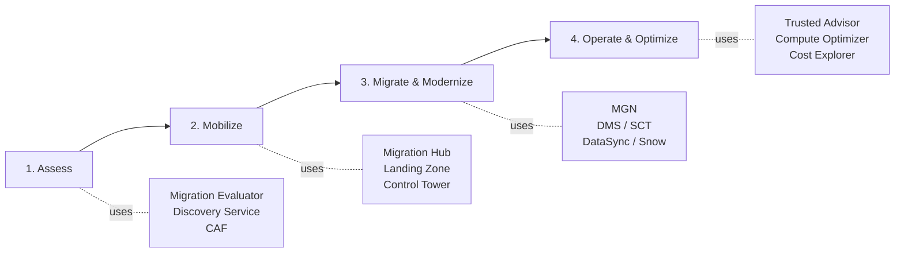

# Cloud Migrations on AWS

> **The 7 R's migration framework (Retire, Retain, Relocate, Rehost, Repurchase, Replatform, Refactor). Backed by AWS Migration Hub (orchestration), Migration Evaluator (free TCO), Application Discovery Service (inventory), and the AWS Cloud Adoption Framework (CAF, 6 perspectives). Pick the right strategy per application — minimize risk, maximize cloud value.**

Maps to: **Domain 4.1 — Select existing workloads for migration**, **Domain 4.2 — Optimal migration approach**, **Domain 4.3 — New architecture for existing workloads**

---

## The 7 R's

| Strategy | Also Known As | What It Is | When to Pick |
|---|---|---|---|
| **Retire** | Decommission | Turn it off entirely | Workload no longer needed; reduces attack surface; 10–20% cost savings |
| **Retain** | Revisit | Do nothing now | Compliance, sunk cost, app being deprecated soon, or recently refreshed on-prem |
| **Relocate** | Hypervisor-level lift | Move VMs as-is (e.g., VMware Cloud on AWS) | Need to move *fast* with zero refactor; preserve VMware tooling |
| **Rehost** | Lift-and-shift | Move servers to EC2 with no code change | Speed, large portfolios; **AWS Application Migration Service (MGN)** |
| **Repurchase** | Drop-and-shop | Replace with SaaS / different product | CRM → Salesforce, HR → Workday, CMS → Drupal |
| **Replatform** | Lift-and-reshape | Small cloud optimizations during migration | DB → RDS / Aurora, app → Beanstalk / Fargate |
| **Refactor** | Re-architect | Redesign for cloud-native | Monolith → microservices/serverless |

> The 7 R's replaced the older 6 R's framework when **Relocate** was added. Older material lists 5 or 6.

---

## AWS Tooling Per Strategy

| Strategy | Primary AWS Service |
|---|---|
| **Retire** | AWS Application Discovery Service identifies low-utilization candidates |
| **Retain** | n/a — track in Migration Hub |
| **Relocate** | VMware Cloud on AWS; **Elastic VMware Service (EVS)** |
| **Rehost** | **AWS Application Migration Service (MGN)** — replaces legacy SMS (Server Migration Service) |
| **Repurchase** | AWS Marketplace, AWS partner SaaS |
| **Replatform** | RDS / Aurora, Beanstalk, Fargate, EKS, MSK; **DMS** for DB engine change |
| **Refactor** | Step Functions, Lambda, EventBridge, AppSync, EKS, ECS Service Connect (App Mesh successor) |

---

## AWS Migration Hub

- **Central console** for tracking migration progress across tools (MGN, DMS, DataSync, Migration Evaluator, partner tools)
- **Migration Hub Orchestrator** — automate migration runbooks (Windows on EC2, SAP, etc.)
- **Migration Hub Strategy Recommendations** — AI-driven recommendations on which R to apply per application
- **Migration Hub Refactor Spaces** — managed environment for incremental refactor (microservice extraction)
- **Migration Hub Journeys** — guided workflows for common migration patterns
- Aggregates data from **Application Discovery Service**, **Migration Evaluator**, and partner tools

---

## AWS Application Discovery Service

- Inventories on-prem servers, applications, dependencies, performance
- **Agentless connector** (VMware vCenter) for VM inventory
- **Discovery Agent** (Windows / Linux) for in-OS metrics + running processes + network connections
- Data lands in Migration Hub for grouping + strategy decisions
- Powers **Application Discovery Service Data Exploration** for analysis in Athena

---

## AWS Migration Evaluator

- **Free** TCO analysis for AWS migration business case
- Collects on-prem usage data (lightweight agentless collector)
- Produces "quick insights" report + detailed business case in 2–4 weeks
- Use BEFORE committing to a migration

---

## AWS Cloud Adoption Framework (CAF)

- AWS's reference model for organizing cloud transformation
- **Six perspectives**: Business, People, Governance, Platform, Security, Operations
- Each perspective has stakeholders, outcomes, capabilities
- Use for enterprise migration planning — org readiness, roadmap

---

## Migration Patterns

### Database Migrations

| Pattern | Tool |
|---|---|
| Same engine (homogeneous): Oracle → Oracle on RDS | **DMS** |
| Different engine (heterogeneous): Oracle → Aurora PostgreSQL | **DMS + SCT (Schema Conversion Tool)** |
| MongoDB → DocumentDB | **DMS** |
| Cassandra → Keyspaces | **DMS** |
| Continuous CDC replication | **DMS ongoing replication** |

### File / Object Migrations

| Pattern | Tool |
|---|---|
| Online file transfer (TB+) | **DataSync** |
| Offline (PB-scale, limited bandwidth) | **AWS Snow Family** |
| Hybrid file access while migrating | **Storage Gateway** (File / Volume / Tape) |
| S3 cross-Region / cross-account replication | **S3 Replication (CRR / SRR)** |
| Continuous file sync | **DataSync** scheduled tasks |

### Server / Application Migrations

| Pattern | Tool |
|---|---|
| Lift-and-shift VM / physical server | **AWS Application Migration Service (MGN)** |
| Mainframe modernization | **AWS Mainframe Modernization** |
| VMware-to-AWS preserving VMware | **VMware Cloud on AWS** / **Elastic VMware Service (EVS)** |
| Hyper-V / KVM / physical | **MGN** (replaces legacy SMS) |
| Microsoft Windows / .NET | **MGN + AWS Microsoft Workloads tooling** |

---

## Migration Phases

1. **Assess** — TCO, readiness, application inventory, dependency mapping
2. **Mobilize** — build landing zone, governance, training, pilot migrations
3. **Migrate & Modernize** — wave-based migration of applications (Rs)
4. **Operate & Optimize** — right-size, automate, continuously improve

---

## Exam Tips

- **7 R's, not 6** — exam expects **Relocate** in the framework
- "Lift-and-shift to AWS" → **AWS Application Migration Service (MGN)** (SMS is EOL since 2023)
- "Database engine change during migration" → **DMS + Schema Conversion Tool (SCT)**
- "Move VMware workloads as-is to AWS" → **VMware Cloud on AWS** or **Elastic VMware Service** (Relocate)
- "Migration TCO / business case" → **AWS Migration Evaluator** (free)
- "Inventory on-prem servers + dependencies" → **AWS Application Discovery Service**
- "Central console to track all migration progress" → **AWS Migration Hub**
- "AI recommendation on which R per app" → **Migration Hub Strategy Recommendations**
- "Mainframe modernization" → **AWS Mainframe Modernization** service
- "Petabyte-scale data transfer with low bandwidth" → **Snow Family** (Snowmobile retired)

---

## Exam Traps

- **6 R's is outdated** — exam uses **7 R's** (added **Relocate**)
- **AWS Server Migration Service (SMS) is EOL** → use **MGN** (descended from CloudEndure Migration)
- **AWS Snowmobile (truck) was retired** in 2024 — never the right answer
- **MGN ≠ DRS** — MGN = one-time migration cutover; DRS = ongoing DR (same underlying tech, different lifecycle)
- **DMS does NOT migrate schema for heterogeneous engines** — pair with **SCT**
- **Migration Evaluator is FREE** — don't pick paid alternatives for TCO
- **CAF has 6 perspectives, not 5** — Business, People, Governance, Platform, Security, Operations
- **Relocate ≠ Rehost** — Relocate keeps hypervisor (VMware Cloud on AWS); Rehost converts to EC2 (MGN)
