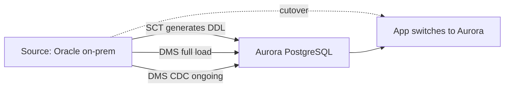
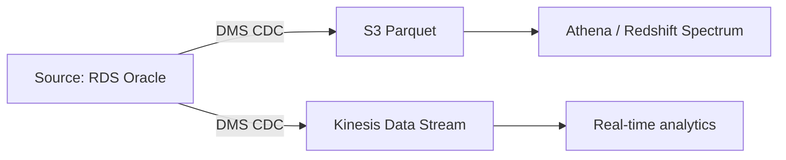

# AWS Database Migration Service (DMS)

> **Migrate databases to / from AWS with minimal downtime. Source DB stays available during migration. Supports homogeneous (Oracle → Oracle) and heterogeneous (Oracle → Aurora PostgreSQL) migrations. Continuous CDC replication. Pair with AWS Schema Conversion Tool (SCT) for heterogeneous schema. DMS Serverless (GA 2023) — no replication instance to manage.**

Maps to: **Domain 4.2 — Optimal migration approach**, **Domain 4.3 — New architecture for existing workloads**

---

## Overview

- Migrate databases to / from AWS with minimal downtime
- **Source DB stays available** during the migration
- **Continuous replication via CDC** — sync after the initial load
- **Provisioned mode** — you size a replication instance (EC2-based)
- **DMS Serverless** (GA 2023) — fully managed, auto-scales replication capacity
- **Fleet Advisor** assesses on-prem DB inventory + sizing recommendations

---

## Source & Target Engines

### Sources

- **Relational**: Oracle, SQL Server, MySQL, MariaDB, PostgreSQL, IBM DB2 LUW + iSeries
- **NoSQL**: MongoDB, Amazon DocumentDB, Azure Cosmos DB
- **Cloud**: RDS, Aurora, Azure SQL, Google Cloud SQL
- **Data warehouses**: Teradata, Greenplum, IBM Netezza
- **Streaming**: Kafka, Kinesis, MSK
- **Object storage**: S3
- **SAP**: SAP ASE (Sybase)

### Targets

- All RDS engines (MySQL, MariaDB, PostgreSQL, Oracle, SQL Server)
- **Aurora MySQL / PostgreSQL**
- **Redshift**, **DynamoDB**, **OpenSearch**, **DocumentDB**, **Neptune**, **Keyspaces (Cassandra)**, **Timestream**
- **S3** (CSV / Parquet for data lakes)
- **MSK** / **Kinesis** (CDC stream → event-driven pipelines)
- **Babelfish for Aurora PostgreSQL** (SQL Server → PostgreSQL with T-SQL compatibility)

---

## Migration Types

| Type | Description |
|---|---|
| **Full Load** | One-time bulk migration |
| **Full Load + CDC** | Bulk load + ongoing replication until cutover |
| **CDC only** | Replicate changes from an already-migrated DB (cross-Region / DR) |

---

## AWS Schema Conversion Tool (SCT)

- **Schema converter** for **heterogeneous** migrations (engine change)
- Converts DDL, stored procedures, views, functions, triggers
- Generates an **assessment report** flagging items needing manual conversion
- **DMS handles data**; **SCT handles schema** — they work together
- Now embedded in DMS Console as **DMS Schema Conversion** (managed, no separate desktop tool)
- Supports: Oracle → PostgreSQL, SQL Server → MySQL / PostgreSQL, MySQL → PostgreSQL, etc.

---

## DMS Serverless (GA 2023)

- **No replication instance** — DMS scales **DCUs (DMS Capacity Units)** based on workload
- Pay per DCU-hour + per GB migrated
- Set min/max DCU range; DMS handles scaling
- Supports a subset of source/target combos (most major ones); check docs
- Ideal for: variable load, infrequent migrations, no instance sizing

---

## Common Patterns

### Heterogeneous Migration (Oracle → Aurora PostgreSQL)

1. SCT converts Oracle schema → PostgreSQL DDL
2. Apply converted DDL to target Aurora PostgreSQL
3. DMS full load: migrate data
4. DMS CDC: keep target in sync while testing
5. Cutover: switch application to Aurora

### Continuous CDC for Analytics

### Zero-ETL vs DMS

- **Zero-ETL** = managed, near-real-time replication for specific source → target pairs (Aurora → Redshift, DynamoDB → Redshift, RDS MySQL/PostgreSQL → Redshift)
- **DMS** = general-purpose tool — broader source/target matrix, full CDC control
- Pick Zero-ETL if your pair is supported; DMS otherwise

---

## Validation

- **DMS Data Validation** — row-by-row comparison post-migration to confirm parity
- **Premigration Assessment** — predicts compatibility issues before kickoff
- **CloudWatch metrics + logs** for observability

---

## Security

- **Encryption in transit** (TLS) and **at rest** (KMS on replication instance + target snapshots)
- **VPC** deployment for replication instance / serverless replication
- **AWS Secrets Manager** for source / target credentials
- **IAM** for control-plane access
- **Endpoint encryption** to source / target databases

---

## Cost

- **Provisioned**: replication instance hours + EBS storage + data transfer
- **Serverless**: DCU-hours + GB migrated
- **No charge** for the target database itself (you pay for RDS / Aurora etc. separately)

---

## Exam Tips

- "Migrate database to AWS with minimal downtime" → **DMS** (source stays available)
- "Heterogeneous engine migration" (Oracle → PostgreSQL) → **DMS + SCT**
- "No replication instance to manage" → **DMS Serverless** (2023+)
- "Continuous replication from on-prem to AWS" → **DMS CDC ongoing replication**
- "Validate migrated data matches source" → **DMS Data Validation**
- "SQL Server → PostgreSQL with T-SQL compatibility" → **Babelfish for Aurora PostgreSQL** (SCT + DMS to migrate)
- "DB → S3 for data lake" → DMS to S3 target (CSV / Parquet)
- "DB change events → real-time analytics" → **DMS CDC → Kinesis / MSK**
- "Assess on-prem DB inventory before migration" → **DMS Fleet Advisor**
- **DMS handles data; SCT handles schema** — both required for heterogeneous

---

## Exam Traps

- **DMS alone does NOT migrate schema for heterogeneous engines** — pair with **SCT** or DMS Schema Conversion
- **DMS Schema Conversion is the managed in-console replacement** for the SCT desktop tool — same concept
- **Source database must remain available** during migration — DMS does not stop it
- **DMS Serverless does NOT support every source/target combination** — check docs
- **CDC requires source-side change capture** (binlog for MySQL, archive logs for Oracle, logical replication for PostgreSQL) — must enable on source
- **DMS is NOT a backup tool** — use **AWS Backup** or native engine backups
- **DMS doesn't do engine version upgrades** — use **RDS Blue/Green Deployments** for in-place upgrades
- **DMS does NOT migrate Oracle PL/SQL packages or SQL Server CLR assemblies automatically** — manual via SCT
- **Zero-ETL ≠ DMS** — Zero-ETL is a specific source→target managed path; DMS is the general tool
