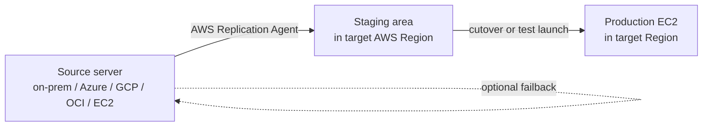

# AWS Application Migration Service (MGN, ex-SMS)

> **Agent-based, continuous block-level replication for lift-and-shift migration of physical, virtual, or cloud servers to EC2. Replaces the legacy AWS Server Migration Service (SMS), which reached end of life in 2023. Built on the same tech as AWS DRS (CloudEndure-based) but with one-time-cutover lifecycle instead of ongoing DR. Supports post-launch automation (SSM), cross-Region launch templates, wave-based migration.**

Maps to: **Domain 4.2 — Optimal migration approach**, **Domain 4.3 — New architecture for existing workloads**

---

## Overview

- Agent-based, **continuous block-level replication** of source servers to a staging area in AWS
- Cutover launches **fully provisioned EC2 instances** in the target Region
- **One-time migration lifecycle** (vs DRS which is ongoing)
- Sources: **physical servers, VMware, Hyper-V, KVM, AWS, Azure, GCP, OCI**
- Replaces **AWS SMS** (deprecated 2022, EOL 2023); successor to **CloudEndure Migration**

> **AWS Server Migration Service (SMS) is EOL** — never propose for new architectures.

---

## How It Works

1. **Install the AWS Replication Agent** on each source server
2. **Continuous block-level replication** to staging (replication servers + EBS)
3. **Configure launch settings** (instance type, subnet, SG, IAM, post-launch scripts)
4. Run **non-disruptive test launches** to validate
5. **Cutover** — MGN launches production EC2; flip DNS / app to AWS
6. Optionally **failback** if cutover needs to be reversed
7. **Decommission source** after stable

---

## Key Capabilities

- **Wave-based migration** — group servers into waves with shared cutover windows
- **Post-launch automation** — run **SSM Automation documents** after EC2 launch (install agents, join AD, configure CloudWatch)
- **Custom launch templates** — instance type, SG, IAM, subnet per server
- **Non-disruptive testing** — launch test instances without affecting source or staging
- **Cross-account migration** — replicate from one account to another
- **License Manager integration** — track BYOL licenses migrating to AWS
- **MAP (Migration Acceleration Program)** credit eligibility

---

## What MGN Replicates (and Doesn't)

| Replicated | NOT Replicated |
|---|---|
| EC2 / on-prem / other-cloud servers | Managed databases (RDS / Aurora / DynamoDB) — use **DMS** |
| EBS-equivalent volumes | S3 — use **DataSync** |
| Linux + Windows OS, apps, files | App configurations outside the OS (CDN, ALB, etc.) |
| Boot volumes + data volumes | Managed services (Lambda, ECS managed) |

---

## MGN vs DRS

| Feature | **AWS MGN** | **AWS DRS** |
|---|---|---|
| Purpose | One-time migration to AWS | Ongoing disaster recovery |
| Replication | Continuous | Continuous |
| Cutover | One-time | Drill anytime + failover on disaster |
| Source after success | Decommission | Keep replicating |
| Lifecycle | Short-term | Long-term |

> Same underlying replication tech (both descended from CloudEndure). Choose by intent: **migrate once → MGN**; **protect ongoing → DRS**.

---

## MGN vs DMS

| Feature | **MGN** | **DMS** |
|---|---|---|
| Scope | Whole servers | Database content only |
| Approach | Block-level | Logical (engine-aware) |
| Use case | Rehost VM to EC2 as-is | Migrate DB engines (especially heterogeneous) |

---

## Migration Patterns

### Lift-and-Shift VMware → EC2

1. Install Replication Agent on each VMware VM
2. MGN replicates to staging in target Region
3. Configure launch template (instance type, SG, post-launch SSM doc)
4. Test launch → validate
5. Cutover wave-by-wave
6. Update DNS, decommission source VMs

### Cross-Cloud (Azure → AWS)

1. Install Replication Agent on Azure VMs
2. Continuous replication over VPN / public internet (encrypted)
3. Test launch, cutover, decommission Azure VMs

### Wave-Based Enterprise Migration

- Group thousands of servers into waves by application boundary
- Each wave: replicate → test → cutover within a maintenance window
- Track in **Migration Hub**

---

## Security

- **Encryption in transit** (TLS) between agent and AWS
- **Encryption at rest** for staging EBS volumes (KMS)
- **VPC** deployment in target Region
- **IAM roles** for replication + launched instances
- **Cross-account replication** via assumed roles

---

## Cost

- **Free replication** — only pay for staging resources (small replication servers + EBS for replicated volumes)
- After cutover, pay for launched EC2 (no extra MGN fee)
- Significantly cheaper than running warm-standby infrastructure
- **MAP credits** can offset EC2 cost for the first migration period

---

## Exam Tips

- "Lift-and-shift on-prem / VMware / cross-cloud to AWS" → **AWS MGN**
- **"AWS SMS"** is **EOL** — never the right answer; use **MGN**
- "Custom config after cutover" → MGN **post-launch SSM Automation documents**
- "Cross-account migration" → MGN supports it (assumed roles)
- "Test migration without affecting source" → MGN **non-disruptive test launch**
- "Group servers into migration waves" → MGN waves + Migration Hub tracking
- "Cheap continuous replication for migration" → MGN (pays only for staging)
- **MGN vs DRS**: MGN = one-time cutover; DRS = ongoing DR
- **MGN vs DMS**: MGN = whole server (OS + apps + data); DMS = database content only

---

## Exam Traps

- **AWS Server Migration Service (SMS) is EOL** — use **MGN** (CloudEndure-based successor)
- **MGN does NOT replicate managed services** — RDS / DynamoDB need service-native tools (DMS, Global Tables)
- **MGN requires the AWS Replication Agent** — agentless is NOT supported (except via separate VMware-direct integrations)
- **MGN ≠ DRS** — same tech, different lifecycle (migration vs DR)
- **Post-launch automation needs SSM Agent on launched instance** — IAM role must include `AmazonSSMManagedInstanceCore`
- **MGN doesn't migrate application configuration outside the OS** — CDN, ALB, DNS need separate handling
- **Cutover replaces the source** — plan rollback (DNS revert, failback) before pulling the trigger
- **Cross-cloud replication may require bandwidth provisioning** — initial sync can take days for TB-scale fleets
