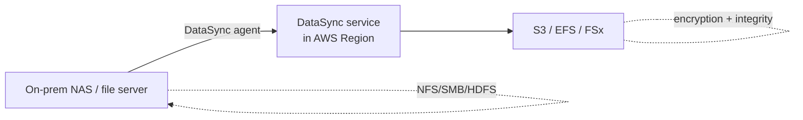

# AWS DataSync

> **Managed data transfer service that automates and accelerates movement between on-premises storage and AWS storage services, or between AWS storage services. NFS / SMB / HDFS / object storage support. Up to 10 Gbps per agent. Built-in encryption + data validation. Common alternative to home-grown rsync / robocopy pipelines.**

Maps to: **Domain 4.2 — Optimal migration approach**, **Domain 2.5 — Storage selection (data movement)**

---

## Overview

- Managed data transfer for on-prem ↔ AWS and AWS ↔ AWS
- Designed for **large-scale migrations, ongoing replication, synchronization**
- **Up to 10 Gbps per agent**
- **Automatic data integrity checks** in-transit AND post-transfer
- **Encryption in transit** via TLS
- **Preserves file metadata + permissions** (POSIX, NFS, SMB)
- Schedule one-time or recurring (hourly / daily / weekly)
- Cheaper + more reliable than rsync / robocopy / `aws s3 sync` scripts for large datasets

---

## Sources & Targets

### Sources
- **NFS** servers (on-prem or cloud)
- **SMB** servers (Windows shares)
- **HDFS** (Hadoop clusters)
- **Object storage** (S3-compatible, including Azure Blob, GCS via S3 compatibility)
- **Amazon S3** (any storage class — including Glacier)
- **Amazon EFS**
- **Amazon FSx** (Windows File Server, Lustre, NetApp ONTAP, OpenZFS)
- **AWS Snowcone** (DataSync agent preinstalled)
- **AWS Outposts** local storage

### Targets
- **Amazon S3** (any storage class)
- **Amazon EFS**
- **Amazon FSx** (Windows File Server, Lustre, NetApp ONTAP, OpenZFS)
- **NFS / SMB / HDFS** (DataSync can push *to* on-prem too)
- **AWS Outposts** local storage

---

## How It Works

1. Deploy the **DataSync agent** as a VM (VMware, Hyper-V, KVM) or EC2 instance near the source
2. Configure source + target **locations**
3. Create a **task** linking source and target
4. Run **on-demand** or **scheduled**
5. DataSync handles parallelization, retries, integrity checks, encryption

---

## Key Features

- **High-performance** — up to 10 Gbps per agent, parallel file streams
- **Bandwidth throttling** — limit per task to avoid WAN saturation
- **Data validation** — integrity checks in-transit AND post-transfer
- **Metadata preservation** — NFS POSIX, SMB ACLs, ownership, timestamps
- **Incremental sync** — only changed files after initial
- **Filters** — include / exclude patterns
- **VPC endpoints** (PrivateLink) — keep traffic off the public internet
- **CloudWatch metrics + EventBridge events**

---

## DataSync Discovery

- Inventory on-premises storage **without an agent** (SNMP / SMB-stat / vendor APIs)
- Profiles **NetApp ONTAP, Pure Storage** arrays
- Recommends AWS storage targets (S3 / EFS / FSx) based on usage
- Generates **TCO + migration recommendations** in Migration Hub

---

## Common Use Cases

- **Migration**: large file shares to S3 / EFS / FSx
- **Hybrid sync**: keep on-prem + AWS in sync continuously
- **Archive**: scheduled push to S3 Glacier / Glacier Deep Archive
- **DR**: sync critical data to AWS as a backup tier
- **Cross-Region / cross-account**: AWS-to-AWS data movement
- **Cross-cloud**: Azure Blob → S3, GCS → S3 (S3-compatible API)

---

## Snowcone Integration

- **Snowcone** ships with DataSync agent preinstalled
- Use when WAN bandwidth is insufficient (remote field site)
- Pattern: copy data to Snowcone locally → ship to AWS → DataSync syncs to S3

---

## DataSync vs Storage Gateway

| Feature | **DataSync** | **Storage Gateway** |
|---|---|---|
| Purpose | Bulk transfer + sync | Hybrid file access |
| Persistence | One-time / scheduled | Persistent gateway |
| Performance | High throughput | Lower latency for access |
| Use | Migrate / replicate data | Cache, access cloud storage as if local |

---

## DataSync vs S3 Transfer Acceleration

| Feature | **DataSync** | **S3 TA** |
|---|---|---|
| Source | NFS / SMB / HDFS / object | S3 client (CLI, SDK) |
| Use case | File / volume migration | Single-S3-bucket upload acceleration |
| Schedule | Yes | No (client-driven) |
| Metadata preservation | Yes | No (object only) |

---

## Exam Tips

- "Migrate file shares (NFS / SMB) to AWS" → **DataSync**
- "Preserve file metadata + permissions during migration" → **DataSync**
- "Schedule recurring data sync from on-prem to S3" → **DataSync**
- "Migrate from NetApp / Pure to AWS storage" → **DataSync + Discovery**
- "No bandwidth for online transfer + small dataset" → **Snowcone with DataSync agent**
- "Inventory + TCO for on-prem storage migration" → **DataSync Discovery**
- "Cross-cloud object migration (Azure Blob → S3)" → **DataSync** (S3-compatible API)
- "Cross-Region / cross-account file transfer" → **DataSync**
- "Hybrid persistent access to cloud storage" → **Storage Gateway** (not DataSync)

---

## Exam Traps

- **DataSync ≠ Storage Gateway** — DataSync moves data; Storage Gateway provides persistent hybrid access
- **DataSync requires an agent** (except for AWS-to-AWS transfers and Discovery)
- **DataSync is NOT real-time replication** — scheduled or on-demand; minimum interval depends on size + bandwidth
- **DataSync charges per GB transferred** — large datasets may cost more than Snow Family for one-time moves
- **Snowcone has DataSync agent preinstalled** — useful for disconnected / low-bandwidth sites
- **DataSync preserves metadata only on supported targets** — S3 stores as object metadata; EFS / FSx preserve natively
- **HDFS support is for data movement** — not a full Hadoop migration tool
