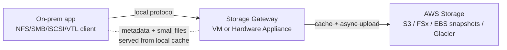

# AWS Storage Gateway

> **Hybrid cloud storage. Connects on-premises applications to AWS cloud storage with a software (VM) or hardware appliance. Four gateway types: S3 File Gateway (NFS/SMB → S3), FSx File Gateway (SMB → FSx for Windows), Volume Gateway (iSCSI block — Cached or Stored), Tape Gateway (VTL → S3 Glacier). Storage Gateway provides persistent hybrid access; DataSync is for one-time / scheduled bulk transfer.**

Maps to: **Domain 4.2 — Optimal migration approach**, **Domain 2.5 — Storage selection**, **Domain 1.1 — Hybrid connectivity**

---

## Overview

- Connects **on-premises** apps to AWS cloud storage (hybrid)
- Deployed as a VM on **VMware ESXi**, **Hyper-V**, or **KVM**, OR as a **Storage Gateway Hardware Appliance**
- Four gateway types:
  - **S3 File Gateway** — NFS / SMB → S3
  - **FSx File Gateway** — SMB → FSx for Windows File Server
  - **Volume Gateway** — iSCSI block storage (Cached or Stored mode)
  - **Tape Gateway** — Virtual Tape Library (VTL) → S3 Glacier
- Use cases: hybrid storage, low-latency cache, DR, backup, tape replacement, lift-and-shift apps that expect NFS/SMB/iSCSI

---

## S3 File Gateway

- **NFS v3 / v4.1** + **SMB v2 / v3** interface
- Files stored as **objects in S3** (one file = one object)
- **Most recently used data cached locally** for low-latency reads
- Storage classes: **S3 Standard, Standard-IA, One Zone-IA, Intelligent-Tiering**
- Transition to **S3 Glacier** via S3 Lifecycle policies (not directly written there)
- File metadata stored as S3 object metadata
- **Bucket policies, versioning, lifecycle, CRR** apply directly to objects
- **SMB integrates with Active Directory** for user authentication
- IAM roles per File Gateway control bucket access

---

## FSx File Gateway

- **Native access to Amazon FSx for Windows File Server** (SMB only)
- **Local cache** for frequently accessed files
- Windows-native — SMB, NTFS, AD, ACLs
- Use: group file shares, home directories with cloud-backed storage

---

## Volume Gateway (iSCSI block)

Presents block volumes via **iSCSI** to on-prem servers. Snapshots stored as **EBS snapshots** (incremental, compressed).

### Stored Volume Gateway

- **Primary data on-premises**; backups are EBS snapshots in AWS
- **Entire dataset stored locally** — low latency for everything
- Volumes: **1 GB – 16 TB** each
- Use: low-latency local access + cloud DR

### Cached Volume Gateway

- **Primary data in S3**; **frequently accessed data cached locally**
- Smaller on-prem footprint
- Volumes: **1 GB – 32 TB** each
- Use: dataset larger than local storage; cache hot blocks

---

## Tape Gateway (VTL)

- **Virtual Tape Library** — looks like physical tape to backup software (Veeam, NetBackup, Backup Exec, Veritas, Commvault)
- Tapes archived to **S3 Glacier / Glacier Deep Archive**
- Replaces physical tape infrastructure
- Cost-effective long-term archive with backup-software compatibility

---

## Hardware Appliance

- For sites without virtualization (no VMware/Hyper-V/KVM)
- Pre-configured rack-mount appliance — install S3 File / FSx File / Volume / Tape Gateway on it
- AWS ships it; you rack it

---

## Common Workflow

---

## Storage Gateway vs DataSync

| Feature | **Storage Gateway** | **DataSync** |
|---|---|---|
| Purpose | Persistent hybrid access | Bulk transfer / scheduled sync |
| Protocols | NFS, SMB, iSCSI, VTL | NFS, SMB, HDFS, S3-compatible |
| Lifetime | Long-running service | Per-task transfer |
| Latency | Low (cached locally) | Higher (transfer-driven) |
| Use case | App keeps using local storage paradigm but data lives in AWS | One-time / scheduled bulk data movement |

---

## Storage Gateway vs Direct S3

- Direct S3 (CLI, SDK) is cheaper + simpler if app speaks S3 API
- Use Storage Gateway when app only speaks NFS / SMB / iSCSI / VTL — no app changes required

---

## Security

- **Encryption in transit** (TLS) between gateway and AWS
- **Encryption at rest** in target services (S3 SSE-KMS, EBS snapshots, Glacier)
- **VPC endpoints** (PrivateLink) for traffic isolation
- **IAM roles** for gateway access to target storage
- **CloudTrail + CloudWatch** for audit + monitoring

---

## Exam Tips

- "On-prem app needs NFS/SMB but back data with cloud" → **S3 File Gateway**
- "Windows file shares + AD + cloud backing" → **FSx File Gateway**
- "On-prem app needs iSCSI block storage" → **Volume Gateway**
  - Entire dataset on-prem, backups to AWS → **Stored**
  - Hot cache on-prem, primary in AWS → **Cached**
- "Replace physical tape backup with cloud" → **Tape Gateway**
- "Hybrid persistent access" → **Storage Gateway** (not DataSync, not Snow Family)
- "One-time bulk migration" → **DataSync** or **Snow Family** (not Storage Gateway)
- "No virtualization on-prem" → **Storage Gateway Hardware Appliance**
- "App expects SMB / NFS but I want S3 lifecycle / versioning / replication" → **S3 File Gateway**

---

## Exam Traps

- **Storage Gateway is for ongoing hybrid access**, NOT one-time migration — for that use **DataSync** or **Snow Family**
- **S3 File Gateway writes to S3 Standard / IA / Intelligent-Tiering** — Glacier requires lifecycle policy, not direct write
- **Volume Gateway Stored mode requires entire dataset on-prem** — won't help shrink local storage
- **Volume Gateway Cached mode primary data lives in S3** — local holds cache only; AWS outage / connection loss affects access
- **FSx File Gateway is SMB only** (no NFS) — for NFS use S3 File Gateway or FSx for Lustre/ONTAP directly
- **Tape Gateway is for backup-software integration** — not file-level user access
- **Storage Gateway is NOT a CDN** — caches locally for one on-prem site only
- **S3 File Gateway is one-to-one** — one file = one S3 object; not optimized for millions of tiny files (use FSx instead)
- **Cross-region replication on S3 File Gateway** applies to the underlying S3 bucket, not the gateway itself
