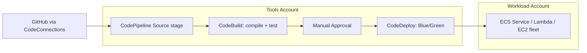

# AWS CI/CD: CodePipeline + CodeBuild + CodeDeploy + CodeArtifact

> **Consolidated note on the AWS-native CI/CD toolchain. CodePipeline orchestrates the workflow (source → build → test → deploy). CodeBuild compiles and tests in managed build containers. CodeDeploy pushes artifacts to EC2, Lambda, ECS, or on-prem with blue/green and canary strategies. CodeArtifact stores private package repositories (npm, Maven, PyPI, NuGet). CodeCommit + CodeStar are closed to new customers (2024) — Git source is typically GitHub/GitLab/Bitbucket or CodeConnections.**

Maps to: **Domain 4.3 — Modernization & CI/CD**, **Domain 3.2 — Improve performance**, **Domain 4.2 — Migration strategies**

---

## AWS CodePipeline

### Overview

- **Fully managed orchestration service** for release pipelines
- Models software release process as **stages** (Source, Build, Test, Deploy, Approval, Invoke) containing **actions**
- Each action is a step (e.g., CodeBuild build, CodeDeploy deploy, manual approval, Lambda invoke)
- Pipeline triggers: source change, schedule, manual, EventBridge, or pipeline-to-pipeline invoke
- Integrates with **CloudFormation, CodeBuild, CodeDeploy, ECS, Lambda, S3, Jenkins, GitHub, GitLab, Bitbucket**

### Pipeline Types — V1 vs V2

| Feature | V1 | V2 |
|---|---|---|
| Git-based triggers with branch / file-path filters | ❌ | ✅ |
| Pipeline-level variables | ❌ | ✅ |
| Parallel actions within a stage | Limited | ✅ |
| Execution modes (Superseded / Queued / Parallel) | Superseded only | All three |
| Stage-level conditions (entry / on-success / on-failure) | ❌ | ✅ |
| Pipeline-to-pipeline invocation action | ❌ | ✅ |
| Cost | Lower flat rate | Per-action-execution pricing |
| Monorepo / branch-based dev | ❌ | ✅ |

> **V2 is the modern default for any new pipeline** — required for trigger filters, parallel runs, variables, and stage conditions.

### Execution Modes (V2)

- **Superseded** (default) — only the latest execution runs; in-flight ones are cancelled when a newer execution arrives
- **Queued** — executions queued and run sequentially in FIFO order; no skipping
- **Parallel** — multiple executions run concurrently; one execution doesn't block another

### Trigger Filters (V2)

- Filter on **Git event type** (push, pull request open/update/close)
- Filter on **branch name** (with glob patterns: `feature/**`, `release/*`)
- Filter on **file paths** (monorepo support: only trigger if files under `services/api/**` change)
- Combine multiple filters with AND / OR logic

### Stage-Level Conditions

- **Entry condition** — only enter the stage if condition passes (e.g., approval present)
- **On-success condition** — gate next stage on test results
- **On-failure condition** — control rollback / notification behavior
- Conditions can use CodeBuild rules or Commands rules to evaluate any custom logic

### Action Types

- **Source** — CodeCommit, S3, ECR, GitHub (via CodeConnections), GitLab, Bitbucket
- **Build** — CodeBuild, Jenkins, TeamCity
- **Test** — CodeBuild, third-party (BlazeMeter, Ghost Inspector, Runscope)
- **Deploy** — CodeDeploy, CloudFormation, ECS, S3, Elastic Beanstalk, AppConfig, Service Catalog
- **Approval** — manual approval action with SNS notification
- **Invoke** — Lambda, Step Functions, EventBridge, **pipeline-to-pipeline**

### Pipeline-to-Pipeline Invocation

- New native action: trigger a downstream pipeline from an upstream one
- Pass pipeline-level variables and source revisions to the downstream pipeline
- Solves the "monorepo with multiple service pipelines" pattern without Lambda glue

### Multi-Account Pipelines

- Single CodePipeline in a **shared services account** deploys to multiple target accounts
- Cross-account roles: pipeline role assumes deploy roles in target accounts
- Encrypt the artifact bucket with **KMS CMK** shared across accounts
- Pattern: dev → stage → prod with manual approval gates between stages

---

## AWS CodeBuild

### Overview

- **Fully managed build service** — compile source, run tests, produce build artifacts
- No build servers to provision; pay per build-minute
- Build environments: AWS-managed images (Ubuntu, Amazon Linux 2/2023, Windows) or **custom Docker images** from ECR
- Build instructions live in `buildspec.yml` (root of source repo) or inline
- Source: S3, GitHub, GitLab, Bitbucket, CodeCommit, ECR

### buildspec.yml Phases

```yaml
version: 0.2
env:
  variables:
    KEY: value
  parameter-store:
    DB_PASS: /prod/db/password   # from SSM
  secrets-manager:
    API_KEY: arn:aws:secretsmanager:...:secret:api-key   # from Secrets Manager
phases:
  install:    # install dependencies / runtime
  pre_build:  # login to ECR, fetch tokens, etc.
  build:      # compile, package
  post_build: # push images, sign artifacts
artifacts:
  files:
    - '**/*'
  base-directory: dist
cache:
  paths:
    - node_modules/**/*
```

### Compute Options

- **EC2-backed** (default) — Linux / Windows / ARM, small to 2xlarge sizes
- **Lambda compute** — sub-minute build start, cheaper for short builds, no warm-up cost
- **Reserved capacity fleets** — dedicated capacity for predictable workloads, lower per-minute cost
- **Auto-scaled fleets** — managed pool with capacity targets
- **macOS builds** — for iOS / macOS app pipelines on dedicated Apple silicon

### VPC Support

- Run builds **inside a VPC** to access private resources (RDS, ElastiCache, EFS, private endpoints)
- Required for builds that need DB seeding, private artifact mirrors, or VPC-only S3 buckets
- VPC builds are slower to start (~30–60s extra cold start for ENI attachment)

### Caching

- **S3 cache** — externally cached layers
- **Local cache** — Docker layer, source, custom paths (faster, ephemeral)
- Speeds up dependency-heavy builds (node_modules, Maven .m2, pip wheels)

### Integration Points

- **CodePipeline** — used as Build or Test action
- **GitHub Actions / Jenkins** — invoke via CLI/SDK
- **EventBridge** — fires on build state changes (SUCCEEDED, FAILED, IN_PROGRESS)
- **CloudWatch Logs** — automatic log capture
- **CloudWatch Metrics** — duration, success rate, queue depth

---

## AWS CodeDeploy

### Overview

- **Fully managed deployment service** for EC2, Lambda, ECS, and on-prem servers
- Decouples deploy logic from infrastructure provisioning
- `appspec.yml` defines deployment lifecycle hooks and target resources
- Supports **in-place** and **blue/green** deployments
- Built-in **automatic rollback** on alarm or failure
- Deployment groups segment targets (e.g., dev fleet, prod fleet)

### Compute Platforms

| Platform | Strategies | appspec |
|---|---|---|
| **EC2/On-Prem** | In-place, Blue/Green (with ELB) | hooks: BeforeInstall, AfterInstall, ApplicationStart, ValidateService |
| **Lambda** | Canary, Linear, All-at-once | hooks: BeforeAllowTraffic, AfterAllowTraffic |
| **ECS** | Blue/Green (mandatory) | task definition + listener swap |

### Deployment Strategies

#### EC2 — In-Place
- Updates instances in-place; brief downtime per instance
- Sub-options: `OneAtATime`, `HalfAtATime`, `AllAtOnce`
- Cheapest, simplest; **NOT zero-downtime**

#### EC2 / ECS — Blue/Green
- Provisions a **new fleet** (green), shifts traffic via ELB target groups
- Old fleet (blue) terminated after success window
- **Zero downtime**, instant rollback (swap traffic back to blue)
- Higher cost during overlap window

#### Lambda — Canary
- `Canary10Percent5Minutes` — 10% traffic for 5 min, then 100%
- `Canary10Percent30Minutes` — 10% for 30 min
- Catches issues with small user impact before full cutover

#### Lambda — Linear
- `Linear10PercentEvery1Minute` — gradual ramp
- `Linear10PercentEvery2Minutes`, `Linear10PercentEvery10Minutes`

#### Lambda — All-at-Once
- 100% traffic immediately; no canary safety net
- For dev/test only

### appspec.yml (EC2 example)

```yaml
version: 0.0
os: linux
files:
  - source: /
    destination: /var/www/html
hooks:
  BeforeInstall:
    - location: scripts/stop_server.sh
      timeout: 300
  ApplicationStart:
    - location: scripts/start_server.sh
      timeout: 300
  ValidateService:
    - location: scripts/healthcheck.sh
      timeout: 60
```

### Automatic Rollback

- Trigger on **CloudWatch alarm** (5xx errors, latency p99, custom metric)
- Trigger on **deployment failure** (failed lifecycle hook)
- Trigger on **stop-deployment** manual signal
- For Lambda canary, alarm during the canary window auto-rolls back to old version
- For ECS blue/green, alarm during test-traffic phase rejects the cutover

### Multi-Account / Multi-Region

- Deploy from a CI account into multiple workload accounts via cross-account IAM roles
- For multi-Region, run parallel CodeDeploy deployments via CodePipeline parallel actions
- Combine with **CloudFormation StackSets** for infra + CodeDeploy for app code

---

## AWS CodeArtifact

### Overview

- **Fully managed artifact repository** for software packages
- Supports **npm, Maven, PyPI, NuGet, Generic, Swift, Cargo, Ruby**
- Acts as a proxy + cache for public registries (npmjs.org, Maven Central, PyPI)
- Domain → Repository → Package → Version hierarchy
- Cross-account / cross-Region replication via domain policies

### Use Cases

- **Single source of truth** for private packages across teams
- **Vulnerability scanning** when combined with Inspector / Amazon Q Developer code review
- **Pull-through cache** — proxy public registries, cache popular versions to reduce external network egress + supply-chain risk
- **Air-gapped builds** — CodeBuild VPC pulls from CodeArtifact via VPC endpoint; no public internet needed

### Integration

- **CodeBuild** — `aws codeartifact login` in pre_build phase, then npm/mvn/pip use the private registry
- **IAM** — repository policies define cross-account access
- **VPC Endpoint (PrivateLink)** — private builds without internet egress
- **EventBridge** — fires on package publish (e.g., trigger downstream pipeline)

---

## Deprecated / Closed-to-New-Customers

| Service | Status | Replacement |
|---|---|---|
| **AWS CodeCommit** | Closed to new customers (Jul 2024) | GitHub, GitLab, Bitbucket via **CodeConnections** |
| **AWS CodeStar** | Discontinued (Jul 2024) | CodePipeline + CloudFormation templates; or Amazon Q Developer for project scaffolding |
| **AWS Cloud9** | Closed to new customers (Jul 2024) | VS Code + AWS Toolkit, or CodeCatalyst Dev Environments |
| **AWS OpsWorks Stacks / Chef Automate / Puppet Enterprise** | EOL May 2024 | Systems Manager + CloudFormation / CDK |

> **Exam relevance**: CodeCommit and CodeStar can still appear in older question banks. If both appear as choices alongside a modern alternative (GitHub via CodeConnections, CodePipeline + CloudFormation), pick the modern alternative.

---

## Common CI/CD Patterns

### Standard Pipeline (3-Account Setup)



### Container Pipeline (ECS / EKS)

1. Source: GitHub → CodePipeline
2. Build: CodeBuild compiles, runs unit tests, builds Docker image, pushes to **ECR**
3. Scan: ECR image scanning (Inspector) gates promotion
4. Deploy: CodeDeploy Blue/Green for ECS (mandatory strategy on ECS)
5. Smoke test: CodeBuild integration tests against new task set
6. Cutover: ECS listener swap; old task set drained

### Multi-Region Active-Active Deploy

- Single CodePipeline; **parallel deploy stages** (V2) into us-east-1 and eu-west-1
- Each region: CodeDeploy Blue/Green with its own ALB target group
- Failure in either region triggers automatic rollback both regions (cross-region alarm)

### Monorepo with Branch / Path Filters (V2)

- One CodePipeline per service
- Each pipeline triggered only when `services/<svc>/**` files change on `main` (V2 path + branch filter)
- Pipeline-to-pipeline invoke for end-to-end integration tests after all per-service deploys complete

### Infrastructure-as-Code Pipeline

- Source: CloudFormation / CDK / Terraform code in Git
- Build: CodeBuild runs `cdk synth` / `tflint` / `cfn-lint` + drift detection
- Deploy: CloudFormation action in CodePipeline (or CDK pipelines, or Terraform via CodeBuild)
- Separate IAM role per environment with least-privilege deploy permissions

---

## Security & Compliance

- **Artifact buckets** encrypted with KMS CMK; bucket policies enforce cross-account access
- **CodeBuild builds in VPC** for private resource access; no public IPs
- **Secrets**: pull from Secrets Manager / Parameter Store in `buildspec.yml`, never hard-code
- **Code signing**: CodeDeploy supports signed Lambda packages; AWS Signer integrates
- **CloudTrail** logs all CodePipeline / CodeBuild / CodeDeploy API calls
- **EventBridge + Lambda** for security automation (e.g., revoke deployment if Inspector flags critical CVE)
- **IAM Pass Role**: pipeline's role passes deploy role to CodeDeploy / CloudFormation — least-privilege boundary

---

## Pricing Snapshot

| Service | Pricing |
|---|---|
| **CodePipeline V1** | $1 per active pipeline-month |
| **CodePipeline V2** | $0.002 per action execution minute (pay per use) |
| **CodeBuild** | Per build-minute by compute size; Lambda compute $0.000125/sec |
| **CodeDeploy** | Free for EC2/Lambda/ECS; $0.02 per on-prem deployment |
| **CodeArtifact** | $0.05/GB-month storage + $0.05 per 10k requests |

---

## Exam Tips

- **CodePipeline orchestrates** — it doesn't build or deploy itself; it invokes CodeBuild / CodeDeploy / CloudFormation actions
- **CodePipeline V2** for any modern pipeline — branch / file-path triggers, parallel stages, pipeline-to-pipeline invoke, stage-level conditions
- **CodeBuild Lambda compute** for fast cheap builds; **macOS builds** for Apple ecosystem
- **CodeBuild in VPC** when builds need private resources (RDS seeding, private S3, internal artifact mirror)
- **CodeDeploy Blue/Green** for zero-downtime EC2 / ECS deployments with automatic rollback on alarm
- **CodeDeploy Canary** (Lambda) → `Canary10Percent5Minutes` is the classic exam answer for "shift 10% then 100%"
- **CodeDeploy Linear** (Lambda) → gradual ramp, e.g., `Linear10PercentEvery1Minute`
- **ECS deployments via CodeDeploy** are **blue/green only** — no in-place option
- **CodeArtifact** for private package registries with pull-through cache (npm, Maven, PyPI, NuGet)
- **CodeConnections** (formerly CodeStar Connections) for GitHub / GitLab / Bitbucket source
- **Multi-account deploys**: single pipeline in tools account assumes roles in dev/stage/prod accounts; artifact bucket KMS-encrypted with cross-account grants
- **Multi-Region**: V2 parallel stages or pipeline-to-pipeline invoke
- **Automatic rollback**: CloudWatch alarm during deployment window → CodeDeploy rolls back
- **Stage approval**: manual approval action sends SNS notification; pipeline pauses until approve / reject
- For **GitOps-style infra**: CodePipeline → CodeBuild (`cdk synth` / `tflint`) → CloudFormation action

---

## Exam Traps

- **CodePipeline does NOT build code** — it orchestrates CodeBuild (or Jenkins/external) for builds. Don't pick "CodePipeline builds the application" as an answer
- **CodePipeline V1 lacks branch / path filters** — if the scenario mentions monorepo or branch-based development, the answer is V2
- **CodeBuild build-minute billing** — long builds get expensive; use caching (S3 or local), Lambda compute for short builds, or reserved fleets for steady workloads
- **CodeBuild VPC builds add cold-start latency** (~30–60s ENI attachment) — don't enable VPC unless you need it
- **CodeDeploy In-Place on EC2 = brief downtime** — for zero-downtime, you need Blue/Green
- **CodeDeploy Blue/Green requires ELB** for EC2 (uses target group swap); ECS uses listener rule swap
- **CodeDeploy ECS = blue/green only** — there's no in-place option on ECS
- **CodeDeploy doesn't manage infrastructure** — it deploys application code to existing infra; for infra-as-code use CloudFormation / CDK / Terraform
- **CodeCommit and CodeStar are closed to new customers** (Jul 2024) — they're never the modern right answer; use GitHub + CodeConnections instead
- **CodeArtifact ≠ ECR** — CodeArtifact is for language packages (npm, Maven, PyPI), ECR is for container images
- **Lambda Canary uses traffic shifting on aliases**, not new function versions — the function version is updated, then alias traffic shifts gradually
- **CodeDeploy auto-rollback needs a CloudWatch alarm in scope** during the deployment / canary window — without the alarm, failures don't roll back
- **Manual approval action** doesn't auto-time-out — pipeline can pause indefinitely; add SNS + Lambda timer to cancel stale approvals
- **Stage-level conditions** (V2) gate execution — without them, all stages run sequentially regardless of context
- **CodePipeline V2 cost can exceed V1** for high-volume pipelines — V1's flat $1/month vs V2's per-action-minute can flip depending on traffic
- **OpsWorks Stacks is EOL** (May 2024) — never the right answer; migrate to Systems Manager + CloudFormation
- **CodeDeploy hooks are sequential per host** — long-running hooks block the deployment timeout; tune `timeout` in `appspec.yml`
